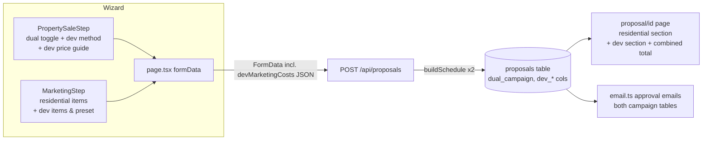

# feat: Dual Target Campaign (Residential + Development Site)

## Summary

Add a toggleable **dual target campaign** mode to sale proposals. When enabled, the proposal outlines two simultaneous campaigns for the one property: the standard **residential campaign** targeting home buyers (realestate.com.au), and a **development site campaign** targeting developers (advertised on realcommercial.com.au). The development campaign carries its own method of sale (e.g. Expressions of Interest), its own optional price guide, and its own marketing items with a one-click preset. The client-facing proposal presents both campaigns with separate advertising totals plus a combined grand total, and approval emails include both campaign tables.

---

## Problem Frame

Some listings (large blocks, corner sites, subdividable land) are worth more to a developer than to a home buyer — but the agency can't know in advance which market will pay more. The current proposal system models exactly one campaign. Agents pitching a dual-market strategy have no way to present it: one method of sale, one marketing table, one internet-presence section hard-coded around residential portals. This feature lets an agent build a single proposal that credibly pitches running both markets at once.

---

## Requirements

- **R1** — A toggle on the Property & Sale wizard step enables "dual target campaign" for sale proposals (off by default; existing proposals unaffected).
- **R2** — When enabled, the agent can set a **development campaign method of sale** (e.g. Expressions of Interest, Tender, Private Sale) independent of the residential method.
- **R3** — When enabled, the agent can optionally set a **development campaign price guide** (min/max), independent of the residential guide, with its own show/hide-on-proposal toggle (mirroring `show_price_range`).
- **R4** — When enabled, the Marketing step captures a **second, separate list of marketing items** for the development campaign, with a one-click **development preset** (realcommercial.com.au listing, development site signboard, EOI/targeted developer campaign items) that is editable like the existing standard/premium packages.
- **R5** — The client-facing proposal renders both campaigns as clearly labelled sections ("residential campaign" / "development site campaign"): each with its own marketing showcase, advertising schedule, internet presence, and method-of-sale explanation. The development campaign's internet presence lists realcommercial.com.au-led channels; the residential internet presence keeps its existing (default) list unchanged.
- **R6** — Advertising costs show **per-campaign totals and a combined grand total**.
- **R7** — Approval emails (agent + client) include both campaigns' marketing tables and totals when the toggle is on.
- **R8** — Editing/duplicating an existing dual-campaign proposal round-trips all dual-campaign fields through the wizard.

---

## Key Technical Decisions

1. **Model the development campaign as parallel `dev_*` columns, not a campaigns table.** The proposals table already stores marketing as JSON TEXT columns (`marketing_costs`, `advertising_schedule`) with runtime `ALTER TABLE` migrations. Two campaigns is the product's ceiling (residential + development); a normalised campaigns table buys nothing and would ripple through every consumer. Mirror the existing columns with a `dev_` prefix.
2. **Reuse the existing marketing-item pipeline for the second campaign, parameterised.** The wizard → FormData JSON → API parse → `AdvertisingWeek[]` schedule-building logic in `src/app/api/proposals/route.ts` is applied twice — once per campaign — rather than forked. The schedule builder is extracted into a helper with parameters for the residential-specific behaviour it currently hardcodes (weekly "Open Home inspection" rows, "Open Homes"/"Internet Listings" keyword split): the residential call keeps identical output; the development call omits open-home rows and uses developer-appropriate ongoing-activity labels.
2b. **`total_advertising_cost` keeps meaning residential-only.** The combined figure is always computed as residential + dev at point of use, never stored. Every existing consumer of `totalAdvertisingCost` (proposal page, both email builders, dashboard, PUT handler's `marketingBudget` mapping) is audited in U6 and either left residential-only deliberately or updated to show the combined figure.
2c. **Toggle on→off keeps dev state client-side.** The wizard retains dev values in memory/draft when the toggle is switched off (so re-enabling restores them) and always submits them; the server-side `dual_campaign = 0` guard (U4) is the single source of truth for ignoring them.
3. **Reuse existing proposal components with props, not duplicated components.** `MarketingShowcase`, `AdvertisingSchedule`, `InternetPresence`, and `MethodExplainer` are rendered a second time with the development campaign's data and a `campaignLabel`-style prop, instead of creating `*Dev` component variants.
4. **Development campaign fields are nullable/optional everywhere.** `dual_campaign INTEGER DEFAULT 0` gates all rendering; `dev_*` columns may be NULL. Existing proposals and the rental flow never see the new fields (toggle is hidden for `proposalType === 'rental'`).
5. **realcommercial.com.au is presentation content, not an integration.** No scraping, listing API, or data pipeline — the development campaign's internet-presence section lists realcommercial.com.au (and optionally developmentready.com.au etc.) as marketing channels only.

---

## High-Level Technical Design

Data flow is the existing single-campaign flow duplicated through `dev_*` fields; no new services, routes, or background jobs.

---

## Scope Boundaries

**In scope:** wizard capture, persistence, proposal-page rendering, approval emails, edit/duplicate round-trip.

### Deferred to Follow-Up Work
- Development-site comparable sales (realcommercial sold data) in the comps step.
- Separate commission structure per campaign (commission stays a single property-level figure).
- Dual-campaign support for rental proposals.
- `/marketing-plan/preview` (localStorage-driven PDF page) rendering of the second campaign — deferred; in v1 it shows the residential campaign only, and U3 hides its entry point when the dual toggle is on so an incomplete preview is never shared.
- Full dual-campaign editing UI on the admin edit page (`src/app/edit/[id]/page.tsx`). In v1, U4 only guarantees the `PUT /api/proposals/[id]` allowlist cannot clobber `dev_*` columns (partial updates leave them untouched).
- `/proposal/[id]/marketing-plan` (proposal-backed marketing plan page) dual rendering — included in U5 only if it reuses the same components trivially; otherwise deferred with the same hide-when-dual treatment as the preview page.

---

## Implementation Units

### U1. Schema, types, and persistence for the development campaign

**Goal:** Proposals can store the dual-campaign flag and all development-campaign data.
**Requirements:** R1–R4, R8
**Dependencies:** none
**Files:** `src/lib/db.ts`, `src/types/proposal.ts`, `src/lib/proposal-generator.ts`
**Approach:** Add columns via the existing runtime `ALTER TABLE` pattern (catch "column already exists"): `dual_campaign INTEGER DEFAULT 0`, `dev_method_of_sale TEXT`, `dev_price_guide_min REAL`, `dev_price_guide_max REAL`, `dev_show_price_range INTEGER DEFAULT 1`, `dev_marketing_costs TEXT`, `dev_marketing_plan TEXT`, `dev_advertising_schedule TEXT`, `dev_total_advertising_cost REAL`. Extend the `Proposal` type with the camelCase equivalents (all optional), and `rowToProposal()` / `proposalToParams()` in proposal-generator with the JSON parse/serialise mirroring `marketing_costs` handling.
**Patterns to follow:** `show_price_range`/`show_commission` migration and round-trip in `src/lib/db.ts` and `src/lib/proposal-generator.ts`.
**Test scenarios:**
- Save a proposal with `dualCampaign: true` and full dev fields → reload via `getProposal` → all dev fields round-trip intact (arrays parsed, numbers numeric).
- Save a proposal with `dualCampaign: false` and no dev fields → row has `dual_campaign = 0`, dev columns NULL; `rowToProposal` returns undefined/empty dev fields without throwing.
- Schema init runs twice on the same DB file → no error (idempotent ALTER TABLE).
**Verification:** Existing proposals load unchanged; a dual proposal survives save → fetch → save without data loss.

### U2. Wizard: dual-campaign toggle, dev method of sale, dev price guide

**Goal:** Agents can switch on the dual campaign and capture the development campaign's sale terms in step 2.
**Requirements:** R1, R2, R3
**Dependencies:** U1 (type names)
**Files:** `src/components/Wizard/steps/PropertySaleStep.tsx`, `src/app/page.tsx`
**Approach:** Add a "dual target campaign — also market as a development site" toggle using the exact `sr-only peer` checkbox pattern of `showPriceRange`, placed as a standalone labelled row at the bottom of the sale-terms block (separated by a rule/extra spacing — it gates a whole section, not a single field). When on, animate in (Framer Motion height/fade, matching the wizard's existing reveals) a "development site campaign" sub-section under a lowercase editorial sub-heading: method-of-sale selector, optional price guide min/max inputs, and a "show on proposal" toggle for the dev guide. **The dev method selector offers only methods with `MethodExplainer` content** — auction, private sale, expressions of interest, plus a new tender entry added in U5; do not offer methods that would fall back to auction copy. Lift state into `src/app/page.tsx` (`dualCampaign`, `devMethodOfSale`, `devPriceGuideMin/Max`, `devShowPriceRange`), include in draft persistence, `resetForm()`, edit-load (`handleEdit`), duplicate, and FormData submission. Per KTD 2c, toggling off retains dev state client-side and still submits it; the server guard ignores it. Hide the toggle entirely for rental proposals.
**Patterns to follow:** `showPriceRange` toggle (PropertySaleStep lines ~442–456) and its page.tsx state/FormData wiring.
**Test scenarios:**
- Toggle off (default) → no dev fields rendered, FormData sends `dualCampaign=0`.
- Toggle on, select EOI, enter guide 1.2M–1.4M → FormData carries all dev values.
- Toggle on, type dev values, toggle off, toggle on again → dev values restored (client retains state per KTD 2c); submission with toggle off carries `dualCampaign=0` and the server ignores dev fields.
- Editing an existing dual proposal pre-fills toggle, method, and guide.
- Rental proposal type → toggle not rendered.
**Verification:** Step 2 captures and round-trips all dev sale terms; non-dual flow visually unchanged.

### U3. Wizard: development campaign marketing items + preset

**Goal:** The Marketing step captures a second item list for the development campaign with a one-click preset.
**Requirements:** R4, R8
**Dependencies:** U2 (dualCampaign state)
**Files:** `src/components/Wizard/steps/MarketingStep.tsx`, `src/app/page.tsx`
**Approach:** When `dualCampaign` is on, render two **stacked labelled sections** (not tabs — both lists and totals must be visible together before generating): "residential campaign" (existing items UI, unchanged) and "development site campaign" (a second `MarketingCostItem[]` list, state `devMarketingCosts` in page.tsx) under a lowercase editorial sub-heading, with its "development preset" button matching the existing package-button placement and its own running total below the list. Add a `DEVELOPMENT_PACKAGE` preset alongside `STANDARD_PACKAGE`/`PREMIUM_PACKAGE` — e.g. realcommercial.com.au Premium Listing, development site signboard, EOI campaign administration, targeted developer eDM, drone/aerial photography with site boundary overlay — costs editable, structure identical to existing presets. Validation (`validateMarketing`) requires ≥1 dev item with descriptions when the toggle is on; the dev-list error renders inline directly above the dev item editor ("add at least one development campaign item"), not as a generic step-level message. Lift `devMarketingCosts` into `src/app/page.tsx` with the same draft persistence, `resetForm()`, edit-load, and duplicate wiring as U2 — **edit pre-fill reads the persisted `dev_marketing_costs` column directly** (the plan stores raw items, so do NOT mirror `handleEdit`'s lossy reconstruction from the advertising schedule). Hide the `/marketing-plan/preview` entry point when the dual toggle is on (see Scope Boundaries). Submit as `devMarketingCosts` JSON + `devMarketingTotal` in FormData.
**Patterns to follow:** Existing package presets and item editor in `MarketingStep.tsx`; `marketingCosts`/`marketingTotal` FormData wiring in `page.tsx`.
**Test scenarios:**
- Dual off → Marketing step renders exactly as today.
- Dual on → both sections render; applying the development preset populates the dev list without touching residential items.
- Dev item costs edit and total recomputes independently of the residential total.
- Dual on with empty dev list → validation blocks generation with the inline message above the dev item editor.
- Edit an existing dual proposal → dev items list matches what was originally submitted, including zero-cost "included" items (pre-filled from `dev_marketing_costs`, not reconstructed from the schedule).
**Verification:** Both item lists arrive in FormData independently with correct totals.

### U4. API: parse and persist the development campaign

**Goal:** `POST /api/proposals` builds and stores the development campaign exactly as it does the residential one.
**Requirements:** R2–R4, R6, R8
**Dependencies:** U1
**Files:** `src/app/api/proposals/route.ts`, `src/app/api/proposals/[id]/route.ts`
**Approach:** Extract the existing marketing-items → `AdvertisingWeek[]` schedule-building block into a parameterised helper (per KTD 2): the residential call produces identical output to today; the development call omits the hardcoded weekly "Open Home inspection" rows and uses developer-appropriate ongoing-activity handling. Apply it to both `marketingCosts` and `devMarketingCosts`. **Also derive `devMarketingPlan`** from the parsed dev items (channel from category/description, cost formatted) so the email tables in U6 have data — the wizard path never populates `marketingPlan` today, so without this the dev email table would iterate NULL and render empty. Parse `dualCampaign`, `devMethodOfSale`, `devPriceGuideMin/Max`, `devShowPriceRange` from FormData (string `'0'/'1'` convention as per `showPriceRange`). Populate the `dev*` proposal fields only when `dualCampaign` is on; ignore stray dev fields when off. Verify the `PUT /api/proposals/[id]` allowlist handler performs partial updates that leave `dev_*` columns untouched (it must not clobber a dual proposal edited via the admin page).
**Patterns to follow:** Existing `marketingCostsJson` parsing and schedule build (route.ts ~lines 232–275); `showPriceRange !== '0'` toggle parsing.
**Test scenarios:**
- Dual-on submission with dev items → row persists dev schedule with week 0 prep + ongoing weeks, dev total correct, and **no "Open Home inspection" rows in the dev schedule**.
- Dual-on submission → `dev_marketing_plan` is populated from the dev items (email-table source).
- Residential schedule output is byte-identical to pre-refactor output for the same input (pure-extraction check).
- Dual-off submission that (stale-draft case) still carries dev FormData fields → dev columns stay NULL, `dual_campaign = 0`.
- Dev items JSON malformed with dual on → matches today's residential behaviour (silent ignore, proposal created with empty dev schedule) — assert that explicitly rather than a 400; the wizard validation in U3 is the guard against this in practice.
- PUT to `/api/proposals/[id]` updating an allowlisted field on a dual proposal → `dev_*` columns unchanged.
**Verification:** A generated dual proposal's API GET returns both campaigns' schedules and totals.

### U5. Proposal page: render both campaigns

**Goal:** Vendors see two clearly labelled campaigns with per-campaign and combined advertising totals.
**Requirements:** R5, R6
**Dependencies:** U1, U4
**Files:** `src/app/proposal/[id]/page.tsx`, `src/components/Proposal/MarketingShowcase.tsx`, `src/components/Proposal/AdvertisingSchedule.tsx`, `src/components/Proposal/InternetPresence.tsx`, `src/components/Proposal/MethodExplainer.tsx`, `src/components/Proposal/BrandStatement.tsx` (dev price guide display), plus a small new `src/components/Proposal/CampaignHeading.tsx` if a shared label treatment helps.
**Approach:** When `proposal.dualCampaign`, render **all residential campaign blocks first in their existing order, then all development site campaign blocks in the same order** under a section break with a lowercase editorial heading ("development site campaign") — never interleaved. Comparables, fee structure, and closing render once, after both campaign blocks. Add optional props rather than new components: `MarketingShowcase` and `AdvertisingSchedule` take a `campaignLabel`; `InternetPresence` already takes a `listings` prop (development campaign passes a realcommercial.com.au-led list; residential keeps its default); `MethodExplainer` renders for the dev method of sale — **add a "tender" entry to `METHOD_CONTENT` with developer-framed copy**, and never let the dev section fall through to the auction-fallback residential copy. Dev price guide shows in the development section only when `devShowPriceRange`. After the development schedule, render the combined advertising investment as a summary block separated by a rule: two labelled sub-lines ("residential campaign — $X" / "development site campaign — $Y") in Inter body size, then a "combined advertising investment" total in the heavier/Playfair treatment matching the existing investment figure. At <640px, schedule tables use the existing horizontal-scroll wrapper and the campaign section heading keeps separation with a rule/low-opacity brand-red band rather than whitespace alone. Non-dual proposals render byte-identical to today.
**Patterns to follow:** Existing conditional rendering driven by `showPriceRange`/`showCommission` props; section composition in `src/app/proposal/[id]/page.tsx`.
**Test scenarios:**
- Dual proposal → both labelled sections render in order (all residential blocks, then all dev blocks); development internet presence lists realcommercial.com.au; combined total equals the sum of the two campaign totals.
- Dual proposal with each selectable dev method (auction, private sale, EOI, tender) → dev MethodExplainer shows that method's copy; never the auction fallback for tender.
- Dual proposal with `devShowPriceRange` off → dev section shows no price guide; residential guide unaffected.
- Non-dual proposal → single campaign, no labels, no combined-total line (regression check).
- Dev campaign with zero-cost ("included") items renders the same included-item treatment as residential.
**Verification:** Visual pass on a generated dual proposal at mobile and desktop widths; non-dual proposal unchanged.

### U6. Approval emails: include both campaigns

**Goal:** Agent and client approval emails reflect the dual campaign.
**Requirements:** R7
**Dependencies:** U1, U4
**Files:** `src/lib/email.ts`
**Approach:** In `buildAgentApprovalHtml`, when `proposal.dualCampaign`, render a second marketing table (sourced from `devMarketingPlan` produced in U4) and advertising-schedule table under a "Development site campaign" heading, plus dev method of sale and dev price guide rows in the details block, and a combined total. Client confirmation email gains a second bullet list of dev marketing items. Audit every consumer of `proposal.totalAdvertisingCost` (both email builders, dashboard, PUT handler's `marketingBudget` mapping, proposal page) and decide per-consumer: residential-only or combined — per KTD 2b, the stored value stays residential-only and combined is computed at point of use; anything presenting "the advertising investment" for a dual proposal must show the combined figure. Guard everything on the flag so existing emails are unchanged.
**Patterns to follow:** Existing marketing table and schedule table builders in `src/lib/email.ts` (~lines 363–389).
**Test scenarios:**
- Approval of a dual proposal → agent email HTML contains both campaign tables, dev method, combined total.
- Approval of a non-dual proposal → email byte-identical to current output (regression).
**Verification:** Trigger approval on a test dual proposal and inspect both rendered emails.

---

## Risks & Dependencies

- **Wizard draft compatibility:** in-flight localStorage drafts predate the new fields — all new state must default safely when absent (same hazard handled for prior fields; verify in U2).
- **Proposal-page regression surface:** U5 touches the highest-visibility page. Mitigation: every change is behind `proposal.dualCampaign`; explicit non-dual regression scenario in U5.
- **Schedule-builder extraction (U4)** is the only refactor of existing behaviour; keep it a pure extraction with identical output before reusing it for the dev campaign.

## Deferred Implementation Notes

- Exact preset item names/costs for the `DEVELOPMENT_PACKAGE` should be confirmed with the agency (realcommercial.com.au listing tier pricing varies); plan ships with editable best-guess defaults.
- `/marketing-plan/preview` is deferred (see Scope Boundaries); U3 hides its entry point for dual proposals. No decision pending during implementation.
