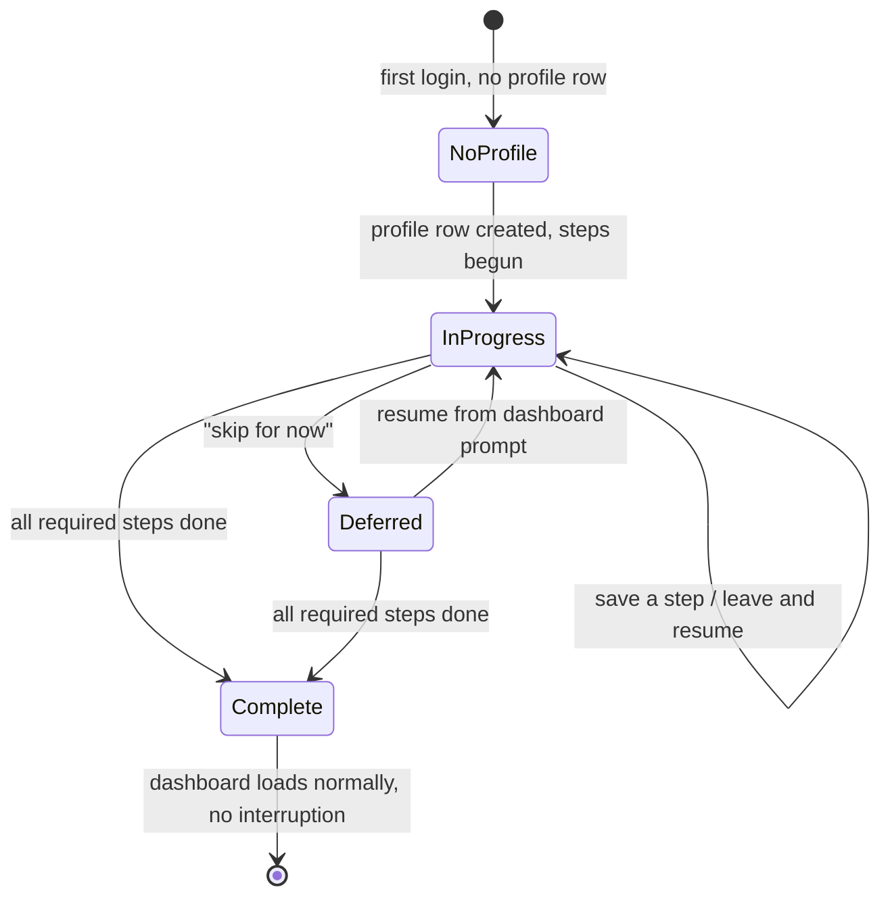
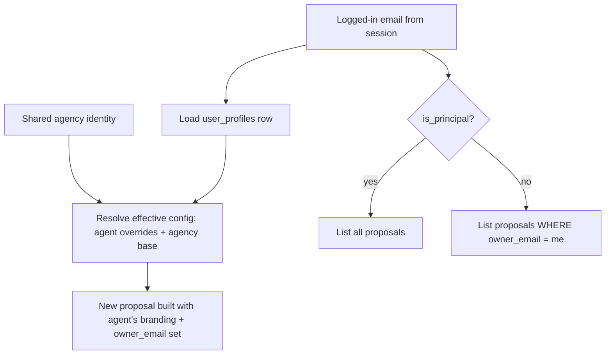

# feat: Team onboarding + per-user profiles

## Summary

Roll the proposal app out to the whole agency. New agents get a resumable first-login onboarding flow to set up their own profile (agent details, photo, branding, fee/format defaults), can do part of it and finish later, and — once set up — log in to a dashboard pre-filled with *their* branding and showing *their* recent proposals. This requires retrofitting per-user ownership onto proposals and replacing the single hardcoded agency/agent config with a per-user profile layered over shared agency identity.

---

## Problem Frame

The app was built single-tenant: there is exactly one agency/agent identity (`AGENCY_DEFAULT` in `src/lib/proposal-generator.ts`, with Stuart's name, photo, bio, phone hardcoded), and proposals are a single shared pool — `listProposals()` and the dashboard read the whole `proposals` table with no owner filter (`src/lib/proposal-generator.ts`, `src/app/api/dashboard/route.ts`). Real per-user accounts now exist (`users` table, scrypt auth, signed sessions), but nothing downstream is user-aware.

So if the team logs in today, every agent would see every other agent's proposals and every generated proposal would carry Stuart's name and photo. Rolling out to the team requires (a) each agent's identity to drive their proposals, and (b) each agent to see their own pipeline. New agents also need a guided way to get set up — entering agent details, uploading a photo, picking proposal defaults — without being forced to complete it all in one sitting.

---

## Requirements

### Onboarding
R1. On first login (profile not yet complete), the agent is taken into a step-by-step onboarding flow rather than an empty dashboard.
R2. Onboarding shows clear progress (which steps are done, which remain) and what is still required to start creating proposals.
R3. The agent can complete onboarding partially, leave, and resume later from where they left off — saved progress persists across sessions.
R4. Onboarding can be skipped/deferred to reach the dashboard, with a persistent prompt to finish remaining setup.
R5. Once all required steps are complete, the profile is marked complete and onboarding no longer interrupts login.

### Per-user profile
R6. Each agent has their own profile: agent name, title, phone, email, photo, bio, and proposal defaults (fee/commission default, proposal format/branding preferences).
R7. A profile carries per-agent overrides layered over shared agency identity (logo, brand colours, ABN, legal name, office list) — agents do not re-enter agency-wide details.
R8. Agents can view and edit their profile after onboarding (a settings surface).

### Identity-aware proposals & dashboard
R9. New proposals are created using the logged-in agent's effective config (their overrides + shared agency identity), not the hardcoded default.
R10. The dashboard and proposal list are scoped by owner: an agent sees only their own proposals.
R11. The principal (Stuart) sees the whole team's pipeline; non-principals see only their own.
R12. Every proposal records its owning agent at creation.

### Rollout / data migration
R13. Existing proposals and the current hardcoded agency/agent profile are assigned to Stuart's account on rollout, so nothing is orphaned and his current setup is preserved.

---

## Key Technical Decisions

**Identity key is the user's email.** Sessions already carry the verified email (`verifySession()` in `src/lib/session.ts`) and the `users` table keys on email. Scoping ownership and profiles by email avoids threading a separate user id through the session and matches the existing cookie contract. (Internally a `user_id` FK is fine; email is the lookup the request layer has cheapest access to.)

**Profile = overrides over a shared base, not a full copy.** A per-user `user_profiles` row holds only agent-level fields and preference defaults. Shared agency identity (logo, colours, ABN, offices) stays in the existing agency config. An "effective config" resolver merges the two at proposal-build time, so agency-wide changes still propagate and agents can't drift the brand. (see R7)

**Onboarding progress is data, not a wizard-position guess.** A small structured progress record (per-step completed flags + an overall `completed` boolean) on the profile drives resumability and the first-login redirect — rather than inferring completeness from whether scattered fields happen to be filled. (see R3, R5)

**Roles via a principal flag, not a roles framework.** A single `is_principal` boolean on the user (seeded for Stuart) satisfies R11. A general role/permission system is over-scoped for one distinction and is deferred.

**Ownership retrofit is additive + backfilled.** Add a nullable `owner_email` to `proposals`, backfill existing rows to Stuart, then treat NULL owner as Stuart's for safety. Avoids a destructive migration and keeps the volume-backed production DB safe. (see R12, R13)

---

## High-Level Technical Design

**Onboarding state (drives first-login routing and resumability — R1–R5):**

**Effective config + ownership at the two seams (proposal build, listing):**

---

## Implementation Units

### U1. Data model: profiles, ownership, roles + backfill

**Goal:** Add the persistence foundation — per-user profiles, proposal ownership, and the principal flag — and migrate existing data to Stuart.

**Requirements:** R6, R7, R12, R13, and the storage side of R3/R5/R11.

**Dependencies:** none.

**Files:** `src/lib/db.ts` (schema + ALTER migrations), `src/lib/__tests__/db-migrations.test.ts`.

**Approach:**
- New `user_profiles` table keyed by user email (FK to `users.email`): agent fields (name, title, phone, email, photo path, bio), preference defaults (default commission rate, proposal format/branding prefs as JSON), an `onboarding_progress` JSON column, and a `completed` boolean.
- Add `owner_email` (nullable TEXT) to `proposals` via `ALTER TABLE` (mirror the existing additive-migration pattern already used for rental/visibility columns).
- Add `is_principal` (INTEGER default 0) to `users`.
- Backfill: set `proposals.owner_email` to Stuart's email where NULL; set `is_principal = 1` for Stuart; seed a `user_profiles` row for Stuart from the current `AGENCY_DEFAULT` values so his live setup is preserved.
- Backfill runs idempotently on startup alongside the existing ALTER-TABLE block.

**Patterns to follow:** the additive `ALTER TABLE ... ADD COLUMN` migration list already in `src/lib/db.ts`; the `nurture_touchpoints` column-add precedent.

**Test scenarios:**
- Fresh DB: all three changes (profiles table, owner_email, is_principal) exist after init.
- Existing DB with legacy proposals and no owner column: migration adds the column and backfills every legacy proposal's `owner_email` to Stuart. *Covers R13.*
- Idempotency: running init twice does not duplicate Stuart's profile row or error on existing columns.
- Stuart's seeded profile reflects the former hardcoded agent name/photo/bio. *Covers R13.*

**Verification:** init on a copy of a pre-migration DB yields owner-stamped proposals, a principal-flagged Stuart, and a Stuart profile; no data loss.

---

### U2. Current-user resolver for the request layer

**Goal:** A single server-side helper that resolves the current user (email + is_principal + profile-complete state) from the session cookie, for use in API routes.

**Requirements:** enabling dependency for R9–R11.

**Dependencies:** U1.

**Files:** `src/lib/current-user.ts`, `src/lib/__tests__/current-user.test.ts`.

**Approach:** Read the `gea_auth` cookie, call existing `verifySession()` to get the email, load the user row + profile, return a small typed object (`{ email, isPrincipal, profileComplete }`) or null when unauthenticated. Centralises what would otherwise be duplicated across routes.

**Patterns to follow:** `verifySession()` usage in the existing auth middleware/cookie handling.

**Test scenarios:**
- Valid session cookie → returns email, correct `isPrincipal`, correct `profileComplete`.
- Missing/tampered/expired cookie → returns null.
- Authenticated user with no profile row yet → `profileComplete: false`.

**Verification:** routes can call one helper to get the acting user; invalid sessions resolve to null.

---

### U3. Profile store + effective-config resolver + API

**Goal:** CRUD for the per-user profile and a resolver that merges agent overrides with shared agency identity into the "effective config" used to build proposals.

**Requirements:** R6, R7, R8, R9.

**Dependencies:** U1, U2.

**Files:** `src/lib/user-profile.ts`, `src/app/api/profile/route.ts`, `src/lib/__tests__/user-profile.test.ts`.

**Approach:**
- `getProfile(email)`, `upsertProfile(email, fields)`, plus progress helpers (`updateOnboardingProgress`, `markComplete`).
- `getEffectiveConfig(email)` — load shared agency config (existing `getAgencyConfig()`), overlay the agent's profile fields; fall back to agency/default values for anything the agent hasn't set. This is the single source new-proposal building reads.
- `GET/PUT /api/profile` — auth-gated (U2), returns/updates the current user's profile only.

**Patterns to follow:** `getAgencyConfig()` merge-with-fallback shape in `src/lib/proposal-generator.ts`; existing API-route auth checks.

**Test scenarios:**
- `getEffectiveConfig` overlays agent name/photo/phone over agency base; agency-only fields (ABN, offices, colours) come through unchanged. *Covers R7.*
- Agent who hasn't set a field falls back to agency/default value (no blanks). *Covers R9.*
- `PUT /api/profile` updates only the caller's row; cannot write another user's profile. *Covers R8.*
- Unauthenticated request → 401.
- Progress helpers persist per-step flags and flip `completed` when all required steps done. *Covers R5.*

**Verification:** a profile edit changes that agent's effective config and nobody else's; unset fields inherit agency values.

---

### U4. Onboarding flow (resumable, step-by-step)

**Goal:** First-login onboarding UI that walks the agent through required setup, shows progress, saves per step, and supports leave-and-resume / skip-for-now.

**Requirements:** R1, R2, R3, R4, R5.

**Dependencies:** U2, U3.

**Files:** `src/app/onboarding/page.tsx`, `src/components/Onboarding/` (step components + progress indicator), `src/components/Onboarding/__tests__/onboarding.test.tsx`, redirect hook in the authenticated layout (`src/app/layout.tsx` or a client guard).

**Approach:**
- Steps: agent details → agent photo (reuse the existing image-upload / `SavedPhotoPicker` flow from `src/components/Wizard/`) → proposal defaults/branding → review & finish. Each step PUTs to `/api/profile` and records progress.
- A progress indicator (done/remaining) and an explicit "save & finish later" plus "skip for now".
- First-login routing: when `profileComplete` is false, authenticated navigation lands on `/onboarding`; a dismissible "finish your setup" banner shows on the dashboard while incomplete (R4).
- Resume: onboarding reads saved progress and opens at the first incomplete step.

**Patterns to follow:** the multi-step `src/components/Wizard/` structure (`WizardLayout`, step components, `index.ts`); `SavedPhotoPicker.tsx` for photo handling; existing uploaded-images storage.

**Test scenarios:**
- New user (no profile) logging in is routed to onboarding, not the dashboard. *Covers R1.*
- Completing a step then leaving and returning reopens at the next incomplete step with prior input intact. *Covers R3.*
- Progress indicator reflects completed vs remaining required steps. *Covers R2.*
- "Skip for now" reaches the dashboard and shows the finish-setup banner; banner gone once complete. *Covers R4, R5.*
- Finishing the last required step flips `completed` and stops the first-login redirect. *Covers R5.*

**Verification:** a new account can do half the setup, log out, log back in, and resume to completion without re-entering finished steps.

---

### U5. Wire proposal creation to the agent's effective config + stamp owner

**Goal:** New proposals build from the logged-in agent's effective config and record `owner_email`.

**Requirements:** R9, R12.

**Dependencies:** U2, U3, U1.

**Files:** `src/app/api/proposals/route.ts`, `src/lib/proposal-generator.ts` (`saveProposal` + agency-config usage), `src/lib/__tests__/proposal-owner.test.ts`.

**Approach:** At proposal create, resolve current user (U2), build with `getEffectiveConfig(email)` (U3) instead of the bare `AGENCY_DEFAULT`/`getAgencyConfig()`, and persist `owner_email`. Wizard prefill (agent block in the proposal) comes from the effective config.

**Patterns to follow:** existing `saveProposal` insert; `POST /api/proposals` handler.

**Test scenarios:**
- Agent A creates a proposal → it carries A's name/photo and `owner_email = A`. *Covers R9, R12.*
- Field A hasn't customised falls back to agency value in the built proposal. *Covers R9.*
- Proposal created with no resolvable user (edge) → rejected/owner defaulted safely, never silently mis-owned.

**Verification:** two different agents generate visibly different-branded proposals, each owned by its creator.

---

### U6. Scope dashboard + proposal listing by owner (principal sees all)

**Goal:** Filter proposal listing and dashboard data by the acting user, with the principal seeing everything.

**Requirements:** R10, R11.

**Dependencies:** U1, U2.

**Files:** `src/app/api/dashboard/route.ts`, `src/app/api/proposals/route.ts` (GET/list), `src/lib/proposal-generator.ts` (`listProposals` gains an owner filter), `src/lib/__tests__/proposal-scope.test.ts`.

**Approach:** Resolve current user (U2). Non-principal: filter `WHERE owner_email = :email` (treating NULL as Stuart's so legacy rows behave). Principal: no filter. Apply the same rule to the dashboard aggregation and the single-proposal fetch (an agent shouldn't open another agent's proposal by id).

**Patterns to follow:** existing direct-DB queries in the dashboard route; `listProposals` query shape.

**Test scenarios:**
- Agent A sees only A's proposals in list + dashboard; not B's. *Covers R10.*
- Principal sees A's and B's. *Covers R11.*
- Agent A requesting B's proposal by id is denied. *Covers R10.*
- Legacy NULL-owner proposal appears for the principal. *Covers R13.*

**Verification:** logged in as a non-principal, neither the list, the dashboard counts, nor direct id access expose another agent's proposals.

---

### U7. Profile settings page (post-onboarding edits)

**Goal:** A settings surface to view and edit profile details and proposal defaults after onboarding.

**Requirements:** R8.

**Dependencies:** U3, U4.

**Files:** `src/app/settings/page.tsx`, `src/components/Settings/` (reuses onboarding step components), `src/components/Settings/__tests__/settings.test.tsx`.

**Approach:** Reuse the onboarding step components in an always-editable form bound to `/api/profile`. Photo re-upload via the same picker. Accessible from dashboard nav.

**Patterns to follow:** the onboarding step components (U4); `/api/profile` (U3).

**Test scenarios:**
- Editing name/photo/defaults persists and is reflected in the next proposal's effective config. *Covers R8.*
- A user can only load/save their own profile.

**Verification:** an agent updates their photo in settings and the next generated proposal uses it.

---

## Scope Boundaries

**In scope:** per-user profiles + onboarding, proposal ownership + owner-scoped listing, principal-sees-all, effective-config branding, migration of existing data to Stuart.

**Non-goals (this work):**
- A general roles/permissions framework (only a single principal flag is built).
- Per-agent customisation of agency-wide identity (logo, ABN, colours, office list stay shared).
- Per-agent isolation of shared agency *data* — comparable sales, the sold/on-market property DB, scrapers, and crons remain agency-wide and shared.
- Admin UI for managing other users (creating/deleting accounts, reassigning proposals).

### Deferred to Follow-Up Work
- Team/admin console for the principal to manage agents and reassign proposals.
- Proposal handover/transfer between agents.
- The parked nurture/SMS approve-before-send work (separate brainstorm).

---

## System-Wide Impact

- **Auth/session:** read-only consumption of the existing session; no change to login/signup.
- **Data migration:** runs against the production volume-backed SQLite on deploy — must be additive and idempotent (U1). This is the highest-risk unit.
- **Existing single-tenant behaviour:** the hardcoded `AGENCY_DEFAULT` stops being the source for new proposals; verify nothing else depends on it directly (approval emails, nurture prompts that embed agent contact details may need to read effective config for the owning agent — flagged as a follow-up check, not in this plan's active scope).

---

## Risks & Dependencies

- **Migration on live data (high).** A bad `ALTER`/backfill on the production DB could corrupt the proposals table. Mitigation: additive columns only, idempotent backfill, test against a copy of the prod DB before deploy, take a volume snapshot/backup first.
- **Legacy NULL-owner rows leaking.** Mitigation: treat NULL owner as Stuart's in scoping queries (U6) and backfill in U1.
- **Approval emails / nurture using stale hardcoded agent details.** These currently embed Stuart's contact info; after rollout an agent's proposal should use that agent's details. Out of this plan's active scope but called out so it isn't missed — verify and, if needed, plan a follow-up to route those through effective config.

---

## Deferred Implementation Notes

- Exact `user_profiles` column set and the JSON shape for branding/format preferences finalise during U1/U3 once the wizard's agent-block fields are enumerated against `src/types/proposal.ts`.
- Whether first-login routing lives in a server layout guard or a client redirect resolves during U4 against how the authenticated layout is structured.
- Photo storage reuse vs. a dedicated profile-photo path resolves during U4 against the existing `uploaded_images` flow.
