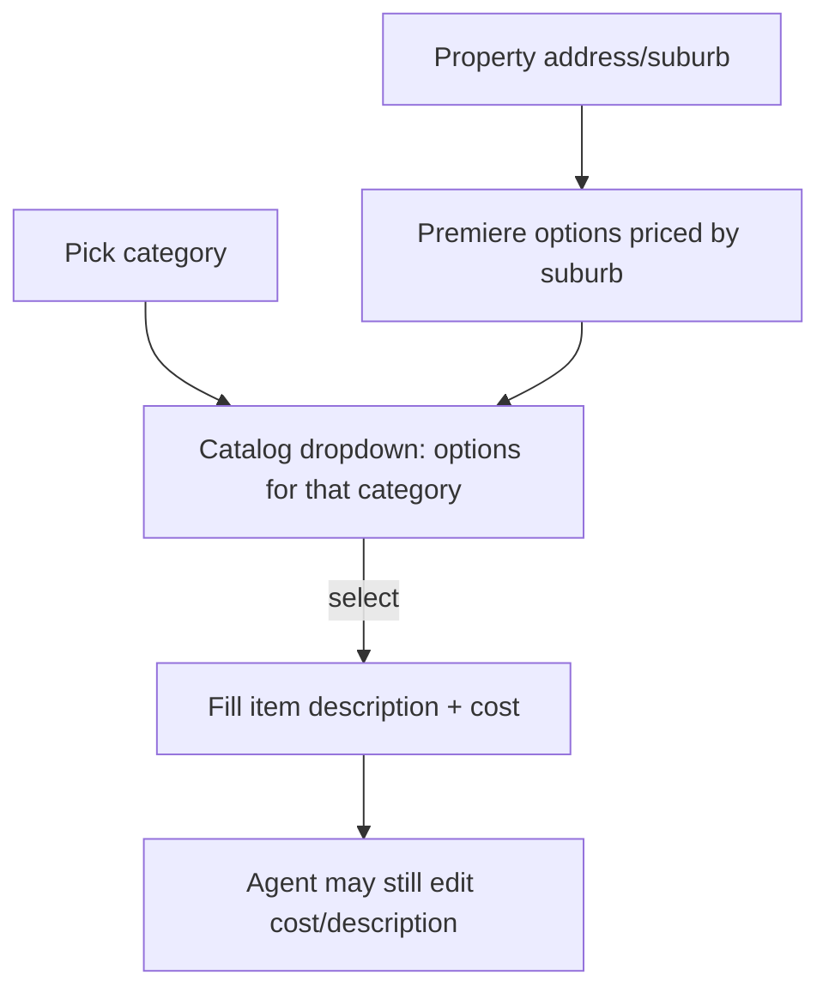
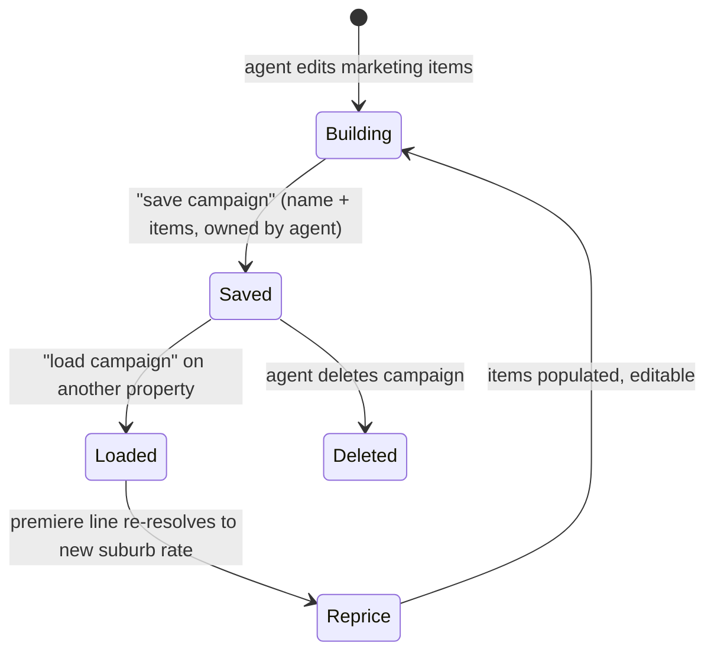

# feat: Simple proposal template + marketing catalog + reusable campaigns

## Summary

Three related improvements to the proposal/marketing flow: (1) a selectable **simple** proposal template that gives vendors a short, scannable page ending in the approve button; (2) a **structured marketing-options catalog** so agents pick photography/signboard/auctioneer/premiere items from dropdowns that auto-fill cost (with the REA premiere suburb rates updated to the 1 July 2026 pricing); and (3) **save & reuse marketing campaigns** so an agent can save a set of marketing items as a named campaign and load it onto another property. The current detailed proposal and free-text editing remain available.

---

## Problem Frame

The client-facing proposal stacks ~18 long sections before the approve button — too much to read for vendors who just want the headline numbers and to say yes. Separately, marketing items are entered as free text + manual cost, so agents retype the same photography packages, signboard sizes, auctioneer fee, and premiere price every time, and the premiere price list is now out of date (new rates apply from 1 July 2026). And there is no way to reuse a marketing campaign an agent has already built — every proposal starts from a generic default or manual entry.

Per-user accounts and ownership now exist (the team-rollout work), so campaigns can be owned per agent the same way proposals are.

---

## Requirements

### Simple proposal template
R1. An agent can choose a **simple** or **full** template when building a proposal; full is the default (current behaviour unchanged).
R2. The simple template renders a short, single-flow client page covering: property/agent header, price guide + method of sale, a trimmed set of comparable sales, fees + marketing cost total, and the approve button.
R3. The simple template still respects the existing show/hide toggles for price range and commission.
R4. The generated PDF of a simple proposal is correspondingly short (it prints the same page).

### Marketing options catalog
R5. Marketing items can be added by selecting a category and then a specific option from a dropdown, which auto-fills description and cost.
R6. The catalog covers the supplied option sets: REA Premiere listings (by suburb), Central signboards, Auctioneer, and Photography (Complete Image) packages.
R7. The REA premiere listing rate is resolved from the property's suburb using the updated 1 July 2026 pricing; unknown suburbs fall back to a sensible default.
R8. After selecting a catalog option, the agent can still edit the description and cost (e.g. a one-off discount) — selection fills, it does not lock.
R9. Free-text manual item entry remains available alongside the dropdowns.

### Save & reuse campaigns
R10. An agent can save the current set of marketing items as a named campaign.
R11. An agent can load one of their saved campaigns into the marketing step, populating the items.
R12. Saved campaigns are owned per agent — an agent sees only their own; the principal may see all (consistent with proposal ownership).
R13. When a saved campaign is loaded onto a property, the premiere line re-resolves to that property's suburb rate rather than carrying the saved suburb's price; other items copy verbatim.
R14. An agent can delete a saved campaign.

---

## Key Technical Decisions

**Simple template is a stored per-proposal flag + a branched layout, not hidden sections.** A `template` value (`full` | `simple`, default `full`) on the proposal drives which layout the client page renders. A purpose-built compact layout (reusing existing pieces — hero/agent, fee visual, a trimmed comparable list) reads as genuinely shorter, whereas hiding blocks from the long-form layout leaves each remaining section heavy. (see R2)

**Marketing catalog is data, dropdowns are a thin UI over it.** A structured catalog (category → list of `{ label, cost }`, plus the suburb→premiere-rate map) lives in the existing marketing library. The editor gains a "choose from catalog" control that, on select, fills the item's description + cost. This keeps the supplied price lists in one maintainable place and leaves the free-text path intact. (see R5, R8, R9)

**Premiere pricing update extends the existing resolver.** The suburb→rate map and `reacomPremiereForSuburb` resolver already exist; this updates the values to 1 July 2026 and adds the new suburbs (Nyora, Tynong, Nar Nar Goon group, Drouin group, Clyde/Cardinia, etc.). The address-based auto-detect is unchanged. (see R7)

**Saved campaigns reuse the per-agent ownership model.** A `saved_campaigns` table keyed by `owner_email` (mirroring proposal ownership and the principal-sees-all rule) stores a name + the marketing items as JSON. Loading re-resolves the premiere line against the target property's suburb so a reused campaign stays correctly priced. (see R12, R13)

---

## High-Level Technical Design

**Marketing catalog → item fill (dropdown flow):**

**Saved campaign lifecycle:**

---

## Implementation Units

### U1. Marketing catalog data + premiere rate update

**Goal:** Add a structured catalog of marketing options and update the REA premiere suburb rates to the 1 July 2026 pricing.

**Requirements:** R6, R7.

**Dependencies:** none.

**Files:** `src/lib/marketing-plan.ts`, `src/lib/__tests__/marketing-plan.test.ts` (if a runner is added; otherwise covered by build).

**Approach:**
- Update `REACOM_PREMIERE_RATES` to the new pricing and add new suburbs:
  - $3019 — Berwick, Beaconsfield, Narre Warren, Narre Warren North, Narre Warren South, Hallam, Cranbourne, Cranbourne North
  - $2819 — Pakenham, Pakenham Upper, Officer
  - $1999 — Clyde, Clyde North, Cardinia
  - $1519 — Nyora, Tynong, Tynong North, Nar Nar Goon, Nar Nar Goon North, Maryknoll, Garfield, Koo Wee Rup
  - $1439 — Drouin, Drouin South, Drouin East, Drouin West
- Add a `MARKETING_CATALOG` structure grouping options by category:
  - **Signboard** — $60 3×7 sale/lease; $100 4×8 sale (Stuart Stock Board); $380 4×8 photo board (Auction, Stuart provides artwork)
  - **Auctioneer** — $700 Aleisha Auctioneer
  - **Photography (Complete Image)** — $150 Standard Rental Shoot (10 images, web only); $205 Sales Day Shoot (10); $255 Sales Day Shoot (20); $390 Drone only w/ overlays (5–6); $370 Sales Day (20) + 2D FP + Site Plan; $550 Sales Day (20) + 2D FP + SP + Drone; $505 Sales Twilight + 2D FP + SP; $685 Sales Twilight + 2D FP + SP + Drone; $130 Floor Plan + Site Plan 2D; $77 Floor Plan redraw
  - **Internet / Premiere** — generated from the suburb-rate map (label includes suburb + price), resolved for the current property.

**Patterns to follow:** existing `REACOM_PREMIERE_RATES`, `reacomPremiereForSuburb`, `REACOM_PREMIERE_RATE_VALUES` in `src/lib/marketing-plan.ts`.

**Test scenarios:**
- `reacomPremiereForSuburb('Berwick')` → 3019; `'Pakenham'` → 2819; `'Clyde North'` → 1999; `'Drouin West'` → 1439; unknown suburb → default.
- Substring match on a full address (e.g. "12 Smith St, Nar Nar Goon North") resolves to 1519.
- Catalog contains every supplied option with the correct cost.

**Verification:** premiere resolver returns the new rates for representative suburbs; catalog enumerates all supplied options.

---

### U2. Catalog dropdowns in the marketing editor

**Goal:** Let agents add marketing items by selecting a category then a catalog option that fills description + cost, with premiere priced by the property's suburb.

**Requirements:** R5, R7, R8, R9.

**Dependencies:** U1.

**Files:** `src/components/Wizard/steps/MarketingStep.tsx`, `src/components/Wizard/steps/__tests__/MarketingStep.test.tsx` (if runner added).

**Approach:** Extend the per-item editor: alongside the existing category `<select>`, add an option dropdown populated from `MARKETING_CATALOG[category]` (and the suburb-resolved premiere list for Internet/Premiere). Selecting an option sets the item's `description` and `cost`; both remain editable afterward. Keep the existing "add manual item" path. The premiere dropdown uses `propertyAddress` to resolve the suburb rate.

**Patterns to follow:** the existing category `<select>` and `update(index, field, value)` handler in `MarketingStep.tsx`; `reacomPremiereForSuburb` usage.

**Test scenarios:**
- Selecting Photography → "Sales Day Shoot (20)" fills description and cost 255.
- Selecting the premiere option for a Berwick property fills cost 3019; for Clyde fills 1999.
- After a catalog fill, editing the cost to a discounted value persists and is used in the total.
- Manual item entry still works with no catalog selection.

**Verification:** choosing catalog options fills the row correctly; totals update; manual entry unaffected.

---

### U3. Saved-campaign store + API (per agent)

**Goal:** Persist named marketing campaigns owned per agent, with list/save/delete.

**Requirements:** R10, R11, R12, R14.

**Dependencies:** U1 (campaign items are marketing items).

**Files:** `src/lib/db.ts` (schema), `src/lib/saved-campaigns.ts`, `src/app/api/campaigns/route.ts`, `src/lib/__tests__/saved-campaigns.test.ts` (if runner added).

**Approach:**
- `saved_campaigns` table: id, `owner_email`, name, items (JSON), created_at. Add via the existing additive-migration block.
- Store functions: `listCampaigns(email)`, `saveCampaign(email, name, items)`, `deleteCampaign(email, id)` — scoped by owner.
- `GET/POST/DELETE /api/campaigns` — auth-gated via `getCurrentUser`; principal sees all, others see own (mirror proposal scoping). Add `/api/campaigns` to the protected API list in `src/middleware.ts`.

**Patterns to follow:** the proposal ownership + `getCurrentUser` scoping built in the team-rollout work; the additive `ALTER`/`CREATE TABLE` pattern in `src/lib/db.ts`.

**Test scenarios:**
- Saving a campaign as agent A, then listing as A returns it; listing as agent B does not.
- Principal listing returns campaigns from all agents.
- Deleting another agent's campaign is rejected.
- Unauthenticated request → 401.

**Verification:** an agent's saved campaigns are isolated to them and round-trip through the API.

---

### U4. Save/load campaign UI

**Goal:** Surface "save this campaign" and "load a saved campaign" in the marketing step, with suburb re-pricing on load.

**Requirements:** R11, R13, R14.

**Dependencies:** U2, U3.

**Files:** `src/components/Wizard/steps/MarketingStep.tsx`, `src/components/Marketing/` (small campaign picker component), tests if runner added.

**Approach:** Add a "save campaign" action (prompts for a name, POSTs current items) and a "load campaign" dropdown (lists the agent's campaigns from `/api/campaigns`, replaces/merges items on select). On load, re-resolve any premiere/Internet item against the current `propertyAddress` suburb so the reused campaign is correctly priced (R13); other items copy verbatim.

**Patterns to follow:** `SavedPhotoPicker` reuse-picker pattern in `src/components/Wizard/`; `reacomPremiereForSuburb`.

**Test scenarios:**
- Save current items as "Auction Standard", reload on a new property → items populate.
- A campaign saved on a Berwick property loaded onto a Clyde property re-prices the premiere line to 1999 (Clyde), other items unchanged.
- Deleting a campaign removes it from the load dropdown.

**Verification:** an agent saves a campaign on one property and applies it to another with correct suburb pricing.

---

### U5. Proposal template field + wizard toggle

**Goal:** Store a `full`/`simple` template choice on the proposal and let the agent pick it in the wizard.

**Requirements:** R1.

**Dependencies:** none.

**Files:** `src/lib/db.ts` (additive column), `src/types/proposal.ts`, `src/lib/proposal-generator.ts` (persist/read), `src/components/Wizard/steps/ReviewGenerateStep.tsx` (or step 2 — the toggle), `src/app/api/proposals/route.ts` (accept the field).

**Approach:** Add `template TEXT DEFAULT 'full'` via the additive-migration block; thread it through the proposal type, save/read, and the create route (FormData field). Add a simple/full toggle in the wizard (default full). No client-facing change yet — that's U6.

**Patterns to follow:** the existing `show_price_range` / `proposal_type` columns and their wizard toggles and FormData plumbing.

**Test scenarios:**
- Creating a proposal with template=simple persists and reads back simple; default is full when omitted.
- Existing proposals (no column) read as full after migration.

**Verification:** the template choice round-trips from wizard to DB to proposal read.

---

### U6. Simple proposal client layout

**Goal:** Render the short single-flow layout for simple-template proposals, ending in the approve button.

**Requirements:** R2, R3, R4.

**Dependencies:** U5.

**Files:** `src/app/proposal/[id]/page.tsx` (branch on template), `src/components/Proposal/SimpleProposal.tsx` (new compact layout), tests if runner added.

**Approach:** When `proposal.template === 'simple'`, render a compact layout: property/agent header (reuse `FullHero`/`AgentProfile` or a condensed header), a price guide + method block (respecting `showPriceRange`), a trimmed `RecentSales` (cap the count), a fee + marketing-total block (reuse `FeeStructureVisual`, respecting `showCommission`), then `ApprovalSection`. Otherwise render the existing full layout unchanged. PDF needs no special handling — `PdfButton` prints the same page (R4).

**Patterns to follow:** existing section components in `src/components/Proposal/`; the current composition in `src/app/proposal/[id]/page.tsx`; the `showPriceRange`/`showCommission` prop usage.

**Test scenarios:**
- A simple-template proposal renders only the compact sections + approval button; the full template renders all sections as before.
- With showPriceRange off, the simple page hides the price; with showCommission off, the fee block hides commission.
- The approve button works on the simple page (same `ApprovalSection`).

**Verification:** a simple proposal shows a short page ending in a working approve button; full proposals are unchanged; the PDF of a simple proposal is short.

---

### U7. Build verification

**Goal:** Confirm the whole change compiles and the app builds.

**Requirements:** supports all.

**Dependencies:** U1–U6.

**Files:** none (CI/build).

**Approach:** Run the typecheck and `next build`; resolve any type/lint breakage.

**Test scenarios:** `Test expectation: none -- build/typecheck gate, not behavioural.`

**Verification:** `tsc --noEmit` clean and `next build` succeeds.

---

## Scope Boundaries

**In scope:** simple selectable template + compact layout; marketing catalog dropdowns; 1 July 2026 premiere rate update; per-agent saved/reusable campaigns.

**Non-goals (this work):**
- Agency-wide shared campaign library (campaigns are per-agent, matching proposal ownership).
- A full template designer / drag-reorder of proposal sections.
- Editing the catalog price lists from the UI (the catalog is code-maintained for now).

### Deferred to Follow-Up Work
- A settings screen to manage the marketing catalog without a code change.
- Sharing a campaign between agents / promoting one to an agency default.

---

## System-Wide Impact

- **Data model:** two additive changes (`proposals.template`, `saved_campaigns` table) on the production volume-backed SQLite — additive and idempotent, consistent with prior migrations.
- **Marketing pricing:** the premiere rate change affects every new proposal's auto-resolved premiere cost from deploy onward; existing saved proposals keep their stored costs.
- **Auth/ownership:** saved campaigns reuse the `getCurrentUser` + owner-scoping model from the team rollout; no auth changes.

---

## Risks & Dependencies

- **Premiere rate correctness.** Wrong suburb→price mapping mis-costs proposals. Mitigation: U1 test scenarios assert representative suburbs against the supplied list; the data is centralised in one map.
- **Saved-campaign re-pricing surprise.** An agent may expect the saved price to carry verbatim. Mitigation: R13 re-resolves premiere to the new suburb (the agreed behaviour); document it in the load UI ("premiere repriced to {suburb}").
- **No unit-test runner.** The repo has only Playwright (e2e), no unit runner. Test scenarios above are the spec; verification falls back to `tsc`/`next build` and manual checks unless a runner is added (out of scope here).

---

## Deferred Implementation Notes

- Exact `saved_campaigns` JSON shape for items finalises during U3 against the `MarketingCostItem` type.
- Whether the simple-template toggle lives in wizard step 2 or the review step resolves during U5 against the current wizard structure.
- The trimmed comparable-sales count for the simple layout (e.g. top 3–4) resolves during U6.
