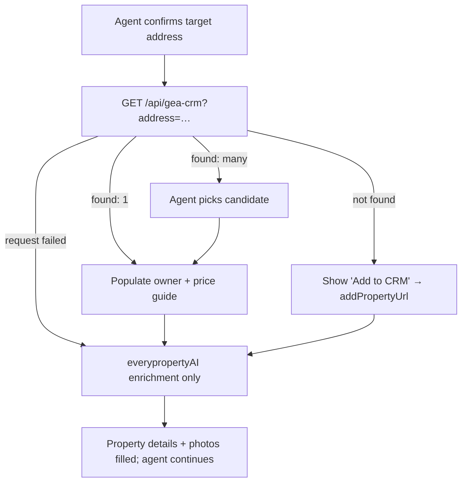

# feat: Step 1 rework + GEA_CRM-first enrichment

## Summary

Rework wizard step 1 so the **target property address sits at the top** and drives a **CRM-first enrichment chain**: on address confirm, look the property up in GEA_CRM → if found, auto-populate owner (and price guide if present); if not found, show an **"Add to CRM"** action that opens the CRM's pre-filled add-property page; then fall back to the existing **everypropertyAI** enrichment for property details (which the CRM often doesn't hold). Also surface the **Express/Full** template choice on step 1, and let agents **advance to the next step without owner details**.

---

## Problem Frame

Step 1 (`src/components/Wizard/steps/ClientDetailsStep.tsx`) currently leads with client/owner fields and only enriches from everypropertyAI on address confirm — there is no GEA_CRM lookup at all (nothing CRM-related exists in the repo). The agency now runs GEA_CRM as the system of record for properties and owners, so a proposal should pull owner + property straight from the CRM when it's there, prompt the agent to add it when it isn't, and only synthesise from everypropertyAI as a fallback. Separately, the Express (short) template can only be chosen on the final review step — agents want it up front — and step 1 blocks progress until owner details are filled, which is friction when the agent just wants to build the proposal and add the vendor later.

GEA_CRM contract is now known (see Sources) — a `GET /api/properties/search?address=` returning `{ found, count, properties[], addPropertyUrl }`, bearer-authed.

---

## Requirements

### Step 1 layout & flow
R1. The target property address field is the first thing on step 1, above owner/client details.
R2. The Express/Full template choice is selectable on step 1 (currently only on the review step).
R3. Owner/client details are optional to advance to the next step; the agent can proceed with address only.
R4. Sending the proposal email still requires a client email (the send gate is unchanged) — only the step-1 "next" gate is relaxed.

### CRM-first enrichment chain
R5. On address confirm, the app queries GEA_CRM for the address before any other enrichment.
R6. If GEA_CRM returns a match, auto-populate owner name/email/phone and price guide (when present), and show that the data came from the CRM (with a link to the CRM record).
R7. If GEA_CRM returns multiple candidates, the agent can pick which one to use.
R8. If GEA_CRM returns no match, show an "Add to CRM" action that opens the CRM's `addPropertyUrl` (pre-filled with the address) in a new tab.
R9. Property details the CRM does not hold (beds/baths/car/type, photos, and price guide when CRM's is null) are filled from everypropertyAI as today.
R10. The CRM token is server-side only and never exposed to the browser.
R11. CRM lookup failure (timeout, 401, network) degrades gracefully to the everypropertyAI path without blocking the agent.

---

## Key Technical Decisions

**A thin server-side CRM client + proxy route, mirroring the everypropertyAI pattern.** A `gea-crm.ts` client calls the CRM API with the bearer token; a `GET /api/gea-crm` route exposes a property search to the browser without leaking the token — exactly how `everyproperty.ts` + `/api/everyproperty` already work. Env vars `GEA_CRM_API_URL` and `GEA_CRM_API_TOKEN` (server-side only). (see R5, R10; Sources)

**CRM supplies owner; everypropertyAI supplies property details.** Per the contract, CRM `bedrooms/bathrooms/carSpaces/propertyType/priceGuide` are null until the property is everypropertyAI-enriched, and `landSize` is always null. So the chain is not "CRM *or* everyproperty" — it's CRM for owner identity (+ price guide when present), then everypropertyAI for the property facts and photos. A CRM match pre-fills owner and skips re-asking; everypropertyAI still runs for the rest. (see R6, R9)

**No-match is a normal 200, not an error.** Branch on `found === false || count === 0` to show "Add to CRM" via the response's `addPropertyUrl` (pre-built — just open it). Reserve the everypropertyAI fallback + graceful-degrade path for actual request failures. (see R8, R11)

**Optional owner = relax validation, not data model.** Step-1 "next" stops requiring client name/email; nothing about storage changes, and the send flow keeps its own email requirement. (see R3, R4)

---

## High-Level Technical Design

**Step-1 address-confirm enrichment chain:**

---

## Implementation Units

### U1. GEA_CRM client + proxy route

**Goal:** Server-side CRM client and a browser-safe search route.

**Requirements:** R5, R10, R11.

**Dependencies:** none.

**Files:** `src/lib/gea-crm.ts`, `src/app/api/gea-crm/route.ts`, `.env` (document `GEA_CRM_API_URL`, `GEA_CRM_API_TOKEN`), `src/lib/__tests__/gea-crm.test.ts` (if a runner is added).

**Approach:** `searchProperty(address)` issues `GET {GEA_CRM_API_URL}/api/properties/search?address=…` with `Authorization: Bearer {GEA_CRM_API_TOKEN}`, a short timeout, and returns the parsed `{ found, count, properties, addPropertyUrl }` or a typed failure. `GET /api/gea-crm?address=` calls it and returns the JSON; the route is auth-gated like other protected APIs and never returns the token. Mirror `src/lib/everyproperty.ts` (`apiUrl()`, `getJson()`, timeout/abort) and `/api/everyproperty`.

**Patterns to follow:** `src/lib/everyproperty.ts`, `src/app/api/everyproperty/route.ts`, the protected-API list in `src/middleware.ts`.

**Test scenarios:**
- Found (count 1) → returns the property with owner fields.
- Not found (`found:false, count:0`) → returns the empty result with `addPropertyUrl`, not an error.
- Multiple candidates → returns the array (newest first, capped 10).
- Missing/invalid token or upstream timeout → typed failure, route responds without leaking the token.
- Browser never receives `GEA_CRM_API_TOKEN`. *Covers R10.*

**Verification:** hitting `/api/gea-crm?address=…` returns CRM JSON for a known address and an empty-but-200 shape for an unknown one; token absent from all client payloads.

---

### U2. Step 1 layout: address first + Express toggle + optional owner

**Goal:** Reorder step 1 to lead with the address, add the Express/Full toggle, and relax the "next" validation.

**Requirements:** R1, R2, R3, R4.

**Dependencies:** none (can land before U3).

**Files:** `src/components/Wizard/steps/ClientDetailsStep.tsx`, `src/app/page.tsx` (pass `template`/`onTemplateChange` into step 1; relax step-1 gating), `src/components/Wizard/steps/__tests__/ClientDetailsStep.test.tsx` (if runner added).

**Approach:** Move the `AddressAutocomplete` block to the top of step 1, above client/owner fields. Add the Full/Express toggle (reuse the control built for the review step; keep the internal `simple` value). Remove client name/email from the step-1 advance condition so "next" is enabled with an address alone; leave the existing send-time email requirement intact. The Express toggle on the review step can stay or be removed — keep both in sync via the same `template` state in `src/app/page.tsx`.

**Patterns to follow:** existing proposalType selector + `AddressAutocomplete` usage in `ClientDetailsStep.tsx`; the template toggle in `ReviewGenerateStep.tsx`; wizard state in `src/app/page.tsx`.

**Test scenarios:**
- Address is the first field; owner fields below it. *Covers R1.*
- Selecting Express on step 1 persists to the generated proposal's template. *Covers R2.*
- With only an address (no owner name/email), "next" is enabled and advances. *Covers R3.*
- Attempting to *send* a proposal with no client email is still blocked. *Covers R4.*

**Verification:** an agent can enter only an address and reach the next step; Express chosen on step 1 yields the short proposal.

---

### U3. Wire the CRM-first enrichment chain into step 1

**Goal:** On address confirm, run CRM lookup → populate owner / pick candidate / "Add to CRM", then fall back to everypropertyAI for property details.

**Requirements:** R5, R6, R7, R8, R9, R11.

**Dependencies:** U1, U2.

**Files:** `src/components/Wizard/steps/ClientDetailsStep.tsx`, `src/app/page.tsx` (owner/price state setters), tests if runner added.

**Approach:** Replace the current "address confirm → everypropertyAI" trigger with: call `/api/gea-crm?address=` first. On a single match, populate owner name/email/phone and price guide (if non-null) and show a "from CRM" indicator linking to `crmUrl`. On multiple matches, render a small candidate picker (address + owner); selection populates. On no match, show an "Add to CRM" button that opens `addPropertyUrl` in a new tab. In all branches (and on CRM failure), continue to the existing everypropertyAI enrichment to fill beds/baths/car/type/photos and price guide when CRM's is absent. CRM owner values take precedence over everypropertyAI for owner fields; everypropertyAI wins for property facts.

**Patterns to follow:** the existing everypropertyAI enrichment effect in `ClientDetailsStep.tsx` (the `/api/everyproperty` fetch + seeding); its loading/indicator UI.

**Test scenarios:**
- CRM single match populates owner + price guide; everypropertyAI still fills property details. *Covers R6, R9.*
- CRM multiple matches → picker shown; choosing one populates that owner. *Covers R7.*
- CRM no match → "Add to CRM" opens the pre-filled `addPropertyUrl`; everypropertyAI still runs. *Covers R8, R9.*
- CRM request fails (timeout/401) → no error shown to agent; everypropertyAI path runs. *Covers R11.*
- CRM price guide null but everypropertyAI has one → everypropertyAI value used.

**Verification:** confirming a CRM-known address fills the owner from the CRM and the property facts from everypropertyAI; an unknown address offers "Add to CRM" and still enriches property facts.

---

## Scope Boundaries

**In scope:** step-1 address-first reorder, Express toggle on step 1, optional owner to advance, GEA_CRM client + proxy + the CRM→everypropertyAI enrichment chain with "Add to CRM" deep link.

**Non-goals (this work):**
- Writing back to GEA_CRM from the proposals app (the "add" flow hands off to the CRM's own page; no create/update API is called).
- Syncing proposal outcomes/owner edits back to the CRM.
- Caching CRM results (treat as a per-proposal call, per the contract's latency note).

### Deferred to Follow-Up Work
- Two-way CRM sync (push proposal status / approved terms back to the CRM record).
- Pre-filling more proposal fields from CRM `status`/history once those are needed.

---

## System-Wide Impact

- **New env vars** `GEA_CRM_API_URL`, `GEA_CRM_API_TOKEN` must be set on Railway before the CRM path works; absent them, U3 degrades to everypropertyAI-only (R11), so the feature ships safe even pre-config.
- **Middleware:** add `/api/gea-crm` to the protected API list.
- **No DB changes** — this is enrichment + UI; owner/property still persist through the existing proposal save.

---

## Risks & Dependencies

- **CRM availability / latency.** A slow or down CRM must not block proposal creation. Mitigation: short timeout + graceful fallback to everypropertyAI (R11); CRM call is per-proposal, not a loop.
- **Token handling.** `GEA_CRM_API_TOKEN` must stay server-side. Mitigation: all CRM calls go through `/api/gea-crm`; U1 test asserts the token never reaches the browser.
- **Owner-precedence confusion.** CRM owner vs everypropertyAI fields could clash. Mitigation: CRM wins for owner identity, everypropertyAI wins for property facts (KTD) — encoded in U3.

---

## Sources & Research

GEA_CRM integration contract (provided by the GEA_CRM project):
- **Base URL:** `https://geacrmai-production.up.railway.app` (prod); `http://localhost:3000`/`:3002` (dev). Store as `GEA_CRM_API_URL` (server-side).
- **Auth:** `Authorization: Bearer <GEA_CRM_API_TOKEN>`; the CRM registers this as `PROPOSALS_API_TOKEN` in its consumer registry (constant-time verify, independently rotatable). Generate with `openssl rand -hex 32`.
- **Lookup:** `GET /api/properties/search?address=<full string>` — auth required (401 without). Case-insensitive partial/fuzzy on address + suburb; returns up to 10 candidates, newest first. Always 200 for valid auth.
  - Found: `{ found: true, count, properties: [{ id, address, suburb, state, postcode, propertyType, bedrooms, bathrooms, carSpaces, landSize, ownerName, ownerEmail, ownerPhone, priceGuide, status, crmUrl }], addPropertyUrl }`.
  - Not found: `{ found: false, count: 0, properties: [], addPropertyUrl }`. Branch on `found === false || count === 0`.
- **Add-property deep link:** the response's `addPropertyUrl` (`…/properties/new?address=<full address>`, pre-fills the address) — just open it.
- **Field semantics:** send the full address string, not components. `ownerName` = firstName + lastName from the property's linked owner contact; owner fields null when no owner linked / contact lacks email/phone. `landSize` always null. `bedrooms/bathrooms/carSpaces/propertyType/priceGuide` derive from everypropertyAI enrichment on the CRM side and are null until enriched; `priceGuide` is a low–high range string, else single estimate, else null (an estimate, not a formal appraisal). `status` is `active | archived | lost` (sales lifecycle, not a listing status).

Local patterns: `src/lib/everyproperty.ts`, `src/app/api/everyproperty/route.ts`, `src/components/Wizard/steps/ClientDetailsStep.tsx`, `src/middleware.ts`.

---

## Deferred Implementation Notes

- Exact candidate-picker UX (inline list vs dropdown) resolves during U3 against the existing step-1 layout.
- Whether to drop the review-step Express toggle or keep both in sync resolves during U2.
- Final CRM request timeout value resolves during U1 against observed latency.
