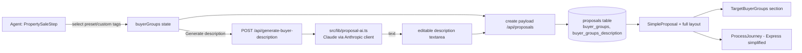

# feat: Express proposal process steps + AI-written target buyer groups

## Summary

The Express (a.k.a. `simple`) proposal is intentionally short, but it currently omits two things vendors find persuasive: a plain "how the sale process works" walkthrough, and a sense of *who* will buy the property. This plan adds both:

1. **Process / simple steps** — render a simplified version of the proposal's existing `saleProcess` steps inside the Express layout (the full template already shows these via `ProcessJourney`; Express does not).
2. **Target buyer groups** — the agent tags the likely buyer groups (preset list + custom entries), clicks **Generate description** in the wizard to have Claude write a short paragraph from those groups plus the property context, edits it if needed, and it renders as a new section on **both** the Express and full proposals.

Both sections reuse patterns already in the codebase: the `ProcessJourney` component and `saleProcess` data for the steps, and the existing Anthropic Claude client (`src/lib/nurture.ts`) for the AI copy.

---

## Problem Frame

- **Express omits process context.** `src/components/Proposal/SimpleProposal.tsx` renders hero → brand statement → agent → recent sales → fees → approval. There is no "how it works" walkthrough, even though every proposal already carries a `saleProcess` array (set per method of sale in `src/app/api/proposals/route.ts`). The full template renders it via `ProcessJourney`; Express drops it.
- **No buyer-demand signal anywhere.** Neither template communicates the target buyer profile. There is no field for it on the proposal, no agent input, and no generated copy. Agents currently can't express "who this home suits" without editing copy by hand.
- **AI exists but isn't used for proposal copy.** The app already talks to Claude for nurture plans (`src/lib/nurture.ts`, `ANTHROPIC_API_KEY`, `claude-sonnet-4`). There is no AI generation surfaced inside the wizard for the agent to drive.

---

## Requirements

- **R1** — The Express proposal shows a concise process-steps section derived from the existing `saleProcess` data, visually consistent with the Express layout.
- **R2** — The agent can select target buyer groups from a preset list and add custom groups, in the wizard.
- **R3** — The agent can trigger AI generation of a buyer-group description in the wizard, see the result, and edit it before saving (in-wizard, editable).
- **R4** — Buyer groups and the (possibly edited) description persist on the proposal and survive edit/duplicate.
- **R5** — A target-buyer-groups section renders on **both** the Express and full client-facing proposals when data is present, and is omitted cleanly when empty.
- **R6** — AI generation degrades gracefully: if `ANTHROPIC_API_KEY` is unset or the call fails, the agent still gets a usable result (clear error + ability to write the description manually) and proposal generation is never blocked.

---

## Key Technical Decisions

- **Reuse `saleProcess` for the Express steps, not a new field (R1).** The data already exists and is method-of-sale-aware. The Express section is a presentation change (render existing `ProcessJourney` data in a simplified form), so no new persistence is needed for the process steps. Keeps the two templates in sync automatically.
- **Two new proposal fields for buyer groups (R2, R4).** `buyerGroups` (array of `{ label }`) and `buyerGroupsDescription` (string). Buyer groups are structured so the section can render chips/tags independent of the prose; the description is stored separately so the agent's edits are preserved verbatim and never regenerated silently. Follows the existing ALTER TABLE migration + `rowToProposal`/`proposalToParams` mapping pattern.
- **In-wizard editable generation via a dedicated API route (R3, R6).** A new `POST /api/generate-buyer-description` calls a thin `src/lib/proposal-ai.ts` helper modelled on `src/lib/nurture.ts`. The wizard owns the editable text state; the route only returns generated text. This mirrors how the app already separates AI libs from UI, and keeps the Anthropic token server-side. Generation is explicitly agent-triggered (button), so an API outage never blocks proposal creation — the agent can type the description manually.
- **Render both sections behind presence checks (R5).** The buyer-groups section renders only when `buyerGroups` is non-empty; the Express process section renders only when `saleProcess` has steps. Empty-state = omit, consistent with how `hidden_sections` and optional sections already behave.
- **Preset list lives in one shared constant.** A single source of buyer-group presets (e.g. first-home buyers, upsizers, downsizers, investors, families, professionals, ret? — final list at execution) shared between the wizard input and any future reuse, so the vocabulary stays consistent.

---

## High-Level Technical Design

The process-steps half is purely the right-hand render path off existing `saleProcess` data; the buyer-groups half adds the agent-input → AI → persist → render loop.

---

## Implementation Units

### U1. Persist buyer groups on the proposal

**Goal:** Add storage and domain-type plumbing for `buyerGroups` and `buyerGroupsDescription`.

**Requirements:** R2, R4

**Dependencies:** none

**Files:**
- `src/lib/db.ts` — two idempotent `ALTER TABLE proposals ADD COLUMN` migrations (`buyer_groups TEXT`, `buyer_groups_description TEXT`), following the existing try/catch migration block.
- `src/lib/proposal-generator.ts` — add fields to `ProposalRow`, `rowToProposal()` (JSON-parse `buyer_groups`), `proposalToParams()` (JSON-stringify).
- `src/types/proposal.ts` — add `buyerGroups?: BuyerGroup[]` and `buyerGroupsDescription?: string` to `Proposal`; add `BuyerGroup { label: string }` interface.
- `src/lib/proposal-generator.test.ts` (or existing test location) — mapping round-trip test.

**Approach:** Mirror how `template`, `marketing_costs`, and other JSON/scalar columns are migrated and mapped. `buyer_groups` stored as a JSON array string; empty/undefined → `null`. No behavioural change to existing fields.

**Patterns to follow:** `template` column migration (`src/lib/db.ts`), JSON field handling for `marketing_costs`/`recent_sales` in `rowToProposal`/`proposalToParams`.

**Test scenarios:**
- Round-trip: a proposal with two buyer groups + a description saves and re-reads identically (`rowToProposal(proposalToParams(p))` preserves values).
- Empty case: a proposal with no buyer groups maps `buyer_groups` to `null` and `rowToProposal` yields `undefined`/`[]` (pick one and assert consistently), description `undefined`.
- Malformed stored JSON in `buyer_groups` does not throw `rowToProposal` — it falls back to empty.

**Verification:** New columns exist on a fresh and a pre-existing DB; saving/loading a proposal with buyer groups preserves them.

---

### U2. AI buyer-group description generation (lib + route)

**Goal:** Generate a short buyer-group description from selected groups + property context, server-side, with graceful fallback.

**Requirements:** R3, R6

**Dependencies:** none (independent of U1)

**Files:**
- `src/lib/proposal-ai.ts` (new) — `generateBuyerGroupsDescription({ buyerGroups, propertyAddress, priceGuide, methodOfSale })` returning a string; reuses the lazy Anthropic client pattern.
- `src/app/api/generate-buyer-description/route.ts` (new) — `POST`, reads JSON body, calls the lib, returns `{ description }` or a `4xx/5xx` with a clear error.
- `src/lib/proposal-ai.test.ts` (new) — fallback + prompt-shape tests (mock the Anthropic client).

**Approach:** Copy the `getAnthropicClient()` lazy-init + missing-key guard from `src/lib/nurture.ts`. System prompt instructs Claude to write 2–3 sentences of vendor-facing copy describing the likely buyers and why the property suits them, given the tags and property facts — no fabricated stats. Keep the model id consistent with `nurture.ts`. The route is the only browser-reachable surface; the token stays server-side.

**Execution note:** Start with a failing test for the no-API-key / API-error path (route returns a clean error, never 500-with-stacktrace), since R6 is the load-bearing reliability requirement.

**Patterns to follow:** `generateNurturePlan()` structure and static fallback in `src/lib/nurture.ts`; existing API route shape (e.g. `src/app/api/gea-crm/route.ts`) for always-JSON responses.

**Test scenarios:**
- Happy path: given 3 buyer groups + property context, the lib calls Claude and returns the model's text (mocked).
- Missing key: with `ANTHROPIC_API_KEY` unset, the route responds with a clear, non-500 error payload the wizard can surface; it does not throw.
- API failure: when the Anthropic call rejects, the route returns a clean error (no unhandled exception).
- Empty groups: route rejects with 400 (nothing to describe) rather than calling the model.
- Prompt safety: generated prompt includes the selected group labels and property address and instructs against inventing figures.

**Verification:** Hitting the route with sample groups returns a sensible paragraph; with no key it returns a clean error and the wizard can still proceed manually.

---

### U3. Wizard: buyer-group input + generate/edit

**Goal:** Let the agent pick preset/custom buyer groups, generate an editable AI description, and persist both with the proposal.

**Requirements:** R2, R3, R4

**Dependencies:** U1, U2

**Files:**
- `src/components/Wizard/BuyerGroupsInput.tsx` (new) — preset tag chips (multi-select) + custom-add field, a **Generate description** button (calls `/api/generate-buyer-description`), and an editable description `textarea`. Loading + error states for the AI call.
- `src/lib/buyer-groups.ts` (new) — shared `BUYER_GROUP_PRESETS` constant.
- `src/components/Wizard/steps/PropertySaleStep.tsx` — render `BuyerGroupsInput` as a new section; thread values via `onChange`.
- `src/app/page.tsx` — add `buyerGroups` / `buyerGroupsDescription` state, cases in `handleFieldChange`, include in `wizardFormData`, and clear in `resetForm` (the `formInstanceKey` remount already covers component-local state).
- `src/app/api/proposals/route.ts` — read the two fields from the create payload and assign to the proposal.
- `src/components/Wizard/BuyerGroupsInput.test.tsx` (new) — interaction tests.

**Approach:** Follow the existing agent-input + everyproperty-enrich patterns in `ClientDetailsStep`/`PropertySaleStep` (controlled fields via `onChange(field, value)`, AI call to an internal route, editable result). Buyer groups serialise as an array of `{ label }`; the description is a plain string the agent can overwrite. Generation is never automatic — the button is the only trigger, and a failed/absent AI call leaves the textarea editable so the agent types their own.

**Patterns to follow:** `EveryPropertyEnrich` and `CrmLookup` in `ClientDetailsStep.tsx` (internal fetch + editable result + silent/clear failure); `MarketingStep` add/remove item UX for the custom-tag interaction.

**Test scenarios:**
- Selecting a preset chip adds it to `buyerGroups`; deselecting removes it.
- Adding a custom group appends a `{ label }` and it renders as a chip; duplicates are prevented (case-insensitive).
- Clicking **Generate** with groups selected calls the route and populates the textarea; the agent can then edit the text and the edited value is what `onChange` reports.
- Generate with no groups selected is disabled (or shows a hint) and does not call the route.
- AI error: the route failing shows an inline error and leaves the textarea usable; proposal can still be generated.
- Reset: after "New proposal", the input is cleared (no leftover chips/description).

**Verification:** In the wizard, pick groups → generate → edit → create proposal; the stored proposal carries the groups and the edited description.

---

### U4. Render process steps + buyer groups on the proposals

**Goal:** Show the simplified process section in Express, and the target-buyer-groups section in both templates.

**Requirements:** R1, R5

**Dependencies:** U1 (buyer-groups data); the process-steps half depends only on existing `saleProcess`.

**Files:**
- `src/components/Proposal/TargetBuyerGroups.tsx` (new) — renders the buyer-group chips + description, in the editorial Express/full style (brand red `#C41E2A`, Playfair/Inter).
- `src/components/Proposal/SimpleProposal.tsx` — insert a simplified process-steps block (reusing `ProcessJourney` data / a compact variant) and the `TargetBuyerGroups` section, behind presence checks.
- `src/app/proposal/[id]/page.tsx` — add `TargetBuyerGroups` to the full layout (full already renders `ProcessJourney`).
- `src/components/Proposal/ProcessJourney.tsx` — if a compact Express variant is needed, add a `compact`/`variant` prop rather than forking the component.

**Approach:** Place the process section in Express after the agent profile / before recent sales (matching the full template's narrative order); place `TargetBuyerGroups` consistently in both templates (e.g. after the method/process explainer, before recent sales). Both sections render only when their data is present, so existing proposals without the new data are unaffected.

**Patterns to follow:** Section composition in `SimpleProposal.tsx` and `src/app/proposal/[id]/page.tsx`; presence-gating like the optional sections already there; `ProcessJourney` for step rendering.

**Test scenarios:**
- Express with `saleProcess` steps renders the process section; Express with empty `saleProcess` omits it.
- Express and full with `buyerGroups` render `TargetBuyerGroups` (chips + description); with empty buyer groups the section is absent.
- A description with line breaks / long text renders without breaking layout.
- An existing proposal created before this feature (no buyer groups) renders unchanged — no empty section, no error.

**Verification:** Generate one Express and one full proposal with buyer groups and a method of sale; both show the buyer-groups section, Express shows the process steps, and a legacy proposal is visually unchanged.

---

## Scope Boundaries

**In scope:** Express process-steps section (reusing `saleProcess`); agent buyer-group input (preset + custom); in-wizard editable AI description; persistence; rendering on both Express and full templates.

### Deferred to Follow-Up Work
- Buyer groups for the **rental** flow (`PropertyRentalStep` / rental proposal) — this plan targets the sale flow; add later if wanted.
- Per-buyer-group descriptions or imagery (only a single combined description is in scope).
- Regenerate-history / versioning of AI descriptions.
- Editing buyer groups from the dashboard outside the wizard.

**Out of scope:** Changing the existing full-template `ProcessJourney`/`saleProcess` content or the method-of-sale step generation.

---

## Risks & Dependencies

- **`ANTHROPIC_API_KEY` must be set on Railway** for live generation. Without it the feature still works (manual description); R6 guarantees no hard failure. Confirm the prod env var before relying on generation.
- **Claude cost/latency** per generation is small (short output) and agent-triggered, so no batching concern.
- **Migration on the volume-mounted prod DB** — the ALTER TABLE additions are idempotent and match the existing pattern; low risk, but verify against the live `data/gea.db` after deploy.
- **Test framework:** match whatever the repo already uses; if none is configured, the U1/U2 unit tests are the minimum worth adding given the persistence + reliability surface.

---

## Sources & Research

- Express template = `template === 'simple'` → `src/components/Proposal/SimpleProposal.tsx`; selection/persistence via `src/app/page.tsx`, `src/app/api/proposals/route.ts`, `src/lib/db.ts` (`template` column).
- Existing AI integration: `src/lib/nurture.ts` (Anthropic client, `ANTHROPIC_API_KEY`, `claude-sonnet-4`).
- Existing process rendering: `src/components/Proposal/ProcessJourney.tsx` + `SaleStep` in `src/types/proposal.ts`; `saleProcess` set in `src/app/api/proposals/route.ts`.
- Persistence pattern: ALTER TABLE migrations in `src/lib/db.ts`; `ProposalRow`/`rowToProposal`/`proposalToParams` in `src/lib/proposal-generator.ts`.
