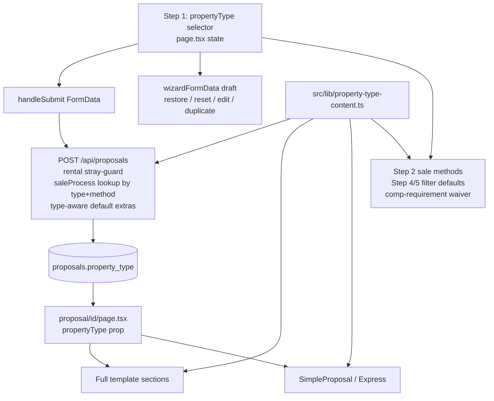

# feat: Property-type-tailored full and Express proposals

## Summary

Add a subject-property-type selector to the wizard — residential house (default), land, unit, apartment, residential development site, commercial property, commercial land — persisted on the proposal and composing with the existing Express/full `template` toggle. A static per-type content library drives tailored copy across all client-facing sections on both templates, tailors sale-method options and `saleProcess` steps, and defaults the comparables filters to the subject type where local data supports it.

---

## Problem Frame

Every proposal today reads as a residential-house pitch. The templates hardcode residential copy (open homes, families, buyer database), the sale-method options and process steps assume residential campaigns, and the comparables steps assume the local residential sold DB has matching stock. Agents pitching land, units, apartments, development sites, or commercial property get copy that undermines the pitch ("0bd 0ba" cards, open-home schedule rows for vacant land, first-home-buyer framing on a commercial site). The Express/full split already exists (`template` column, `SimpleProposal.tsx`); what's missing is the property-type dimension across both.

---

## Requirements

**Selection and persistence**

- R1. The agent can select one of seven property types in wizard Step 1: residential house (default), land, unit, apartment, residential development site, commercial property, commercial land. The selector composes with the existing Express/full toggle — every type × template combination is valid.
- R2. The type persists as a `property_type` column on `proposals`, round-trips through create, draft save/restore, edit, duplicate, and the quick-edit page, and reads as `house` for existing proposals.
- R3. The selector is hidden for rental proposals and a stray `property_type` value is not persisted on rentals (mirrors the existing `dualCampaign` stray-field guard).

**Content tailoring**

- R4. All client-facing proposal sections render per-type copy from a single static content library, on both the full template and Express (`SimpleProposal`). Sections that make no sense for a type (e.g. VIP residential buyer database for commercial) are omitted by page-level gating on the type's library entry.
- R5. Sale-method options in Step 2 are tailored per type (commercial types emphasise Expressions of Interest and Tender), and server-side `saleProcess` steps are set per type × method with defined precedence.
- R6. Residential-only artefacts are suppressed for non-residential types: no auto-injected "Open home inspection" advertising rows for land/commercial, no "0bd 0ba" bed/bath rendering on comparable cards for land and commercial types.
- R7. Default generated copy is type-aware: the persisted `databaseInfo` default is generated per type at creation, and `MarketingStrategy`'s render-time `DEFAULT_APPROACH` fallback is sourced from the content library per type, so default body copy never contradicts type-tailored headings (`areaAnalysis` has no default copy — that section already renders nothing when absent).

**Data sections**

- R8. The comparables property-type filter in Steps 4 and 5 defaults from the subject type via an explicit mapping (apartment → unit, development site → land, commercial → no filter), re-defaults when the agent changes type mid-wizard, and shows a clear empty state for types with no local data.
- R9. Types with no expected local comparables data (land, residential development site, commercial property, commercial land) can proceed past Step 4 with zero selected comparables; empty data sections are omitted cleanly on the proposal page.

---

## Key Technical Decisions

- **Static content library, not AI rewriting.** One new module `src/lib/property-type-content.ts` keyed by type, following the `METHOD_CONTENT` precedent in `src/components/Proposal/MethodExplainer.tsx` and the lib-level constants precedent of `src/lib/marketing-plan.ts`. Deterministic, zero API cost, consistent tone. Unknown/missing type falls back to `house` everywhere.
- **One column, string union.** `property_type TEXT DEFAULT 'house'` added via the additive `newColumns` migration in `src/lib/db.ts` (idempotent try/catch, same lineage as `template`). `PropertyType` union in `src/types/proposal.ts`. No new tables — seven types is the ceiling, matching the deliberate flat-columns philosophy from the dual-campaign plan.
- **Legacy proposals are `house`.** `rowToProposal` falls back to `'house'`; re-saving a legacy proposal via edit stamps it `'house'` explicitly. This is a faithful interpretation, not a data risk — every existing proposal is a residential-house pitch.
- **Render-time library wins for framing copy; the one persisted default becomes type-aware at creation.** Component-hardcoded copy (brand statement, VIP buyers, marketing strategy framing, closing) branches on a `propertyType` prop at render, including `MarketingStrategy`'s `DEFAULT_APPROACH` fallback. The only persisted per-type default is `databaseInfo` (`getDefaultProposalExtras` in `src/lib/proposal-generator.ts`, `createProposal` in `src/lib/spreadsheet-parser.ts`). This prevents the "commercial headline over families-in-this-suburb body" mismatch.
- **`saleProcess` precedence: rental → type+method → type default.** The existing rental and auction overrides in `src/app/api/proposals/route.ts` are refactored into a single lookup: rental keeps its steps untouched; otherwise the library resolves steps by (type, method). Method keys resolve case-insensitively, and a method with no entry for the type (including the empty-string "n/a" option and Tender on residential types) falls back to that type's default steps. House auction entries are lifted verbatim from route.ts; house default entries from `DEFAULT_SALE_PROCESS` in `src/lib/spreadsheet-parser.ts`. One code path, no double-override collisions.
- **Per-type section omission is page gating, not `hiddenSections`.** `hiddenSections` values are wizard step IDs that double as the wizard's `disabledStepIds`, and the proposal page only gates the step-backed sections — merging non-step values into it would do nothing on the page and have no toggle UI, while hiding `sold`/`forsale` would silently switch wizard Steps 4/5 off. Instead, the proposal page gates non-step sections directly on the library entry (`VIPBuyers` renders only when the type's `showsVipBuyers` is true), data sections omit themselves when empty, and `hiddenSections` keeps its current step-backed meaning untouched. Components additionally guard bed/bath display internally for land/commercial.
- **Type switch mid-wizard: keep agent work, re-default derived defaults visibly.** Selected comparables and marketing items are never silently cleared. Method of sale re-defaults only if the current selection isn't offered for the new type — with a brief inline notice near the selector so the agent sees the change — and the comparables filter re-defaults. The re-default logic runs only in the `handleFieldChange` property-type case (agent action); programmatic sets in `handleEdit`/`handleRestoreDraft` never trigger it. Cheap, non-destructive, predictable.
- **Fix the `template` draft-restore gap while adding `propertyType` to the same lines.** `template` is currently missing from `wizardFormData`/`handleRestoreDraft`/`resetForm`; adding `propertyType` correctly to those exact code paths while leaving the known `template` bug in place would replicate the defect class in the same diff hunk. Both fields go in.
- **Comparable-requirement waiver is per-type, not global.** `canProceed` currently exempts only rentals from the ≥1 sold comp rule; the library gains a `requiresComparables` flag per type — false for land, residential development site, and both commercial types, because the local sold DB has zero land-typed rows and no commercial data, so a hard ≥1-comp rule would block the wizard for exactly the types this feature adds. Sale-path behaviour for house/unit/apartment stays byte-identical, honouring the boundary set in the rental-leased comparables fix.

---

## High-Level Technical Design

Type flows one way: wizard state → FormData → column → prop.

Per-type behaviour matrix (content library entries):

| Type | Sale methods | Comparables filter | Requires comps | VIP buyers section | Open-home rows |
|---|---|---|---|---|---|
| house (default) | current list | none (preserves pre-feature "Any" default) | yes | shown (current behaviour) | yes |
| unit | current list | unit + apartment | yes | shown | yes |
| apartment | current list | unit + apartment | yes | shown | yes |
| land | current list | land | no | omitted | no |
| residential development site | current + Tender (existing `DEV_METHODS_OF_SALE`) | land | no | omitted | no |
| commercial property | EOI, Tender, Auction, Private Sale (EOI first) | none | no | omitted | no |
| commercial land | EOI, Tender, Auction, Private Sale (EOI first) | none | no | omitted | no |

Exact copy strings and final hidden-section sets are authored during implementation; the table pins the structure and defaults.

---

## Implementation Units

### U1. Persistence: `property_type` column and round-trip plumbing

- **Goal**: `property_type` exists, persists, and reads back with a `house` fallback everywhere proposals are loaded.
- **Requirements**: R2, R3
- **Dependencies**: none
- **Files**: `src/lib/db.ts`, `src/lib/proposal-generator.ts`, `src/types/proposal.ts`, `src/app/api/proposals/route.ts`, `src/app/api/proposals/[id]/route.ts`
- **Approach**: Append the ALTER to the `newColumns` array in `src/lib/db.ts` (`TEXT DEFAULT 'house'`). Thread through `ProposalRow`, `rowToProposal` (fallback `'house'`), `proposalToParams`, and both column lists in `saveProposal`. Add `propertyType?: PropertyType` to the `Proposal` interface mirroring `template`. Read the FormData field in the POST route with a whitelist coercion to the seven values; skip persisting for `proposalType === 'rental'` (mirror the `dualCampaign` stray-field guard). Add `property_type` to the PUT allowlist in `[id]/route.ts`.
- **Patterns to follow**: `template` column lineage (`db.ts` line ~324, `proposal-generator.ts`, `types/proposal.ts` line ~72); `show_price_range` migration reference.
- **Test scenarios**:
  - DB init runs twice without error (idempotent migration).
  - A pre-existing row without the column reads back as `propertyType: 'house'`.
  - Create with `property_type=commercial-property` → GET returns it; create with an invalid value → stored as `house`.
  - Rental create with a stray `property_type` field → column stays `house` (not persisted).
  - PUT with `property_type` updates it; PUT without it leaves it untouched (no clobber).
- **Verification**: round-trip create → fetch → edit-save on a copy of `data/gea.db`; existing rows unaffected.

### U2. Content library: `src/lib/property-type-content.ts`

- **Goal**: Single source of truth for all per-type behaviour and copy.
- **Requirements**: R4, R5, R6, R8, R9
- **Dependencies**: none (parallel with U1)
- **Files**: `src/lib/property-type-content.ts` (new), `src/lib/property-type-content.test.ts` (new)
- **Approach**: Export the `PropertyType` union values, a `PROPERTY_TYPE_CONTENT` record per the behaviour matrix above, and a `getPropertyTypeContent(type?)` accessor with `house` fallback. Each entry carries: display label; section copy blocks (brand statement, marketing-strategy framing including the `DEFAULT_APPROACH` fallback text, area-analysis framing, VIP-buyers copy where shown, process-journey intro, fee framing, closing statement — `InternetPresence` and `StatsBar` need no per-type copy blocks, they only get the U5 display guards); `saleMethods` list; `saleProcessSteps` keyed by lowercase method with a per-type default entry (house auction steps lifted verbatim from route.ts; house defaults from `DEFAULT_SALE_PROCESS` in `src/lib/spreadsheet-parser.ts`); `comparablesFilter` mapping value(s) or null; `requiresComparables`; `showsVipBuyers`; `includesOpenHomes`; `showsBedsBaths`. Copy is authored here in GEA's existing tone (lowercase headlines, editorial voice).
- **Patterns to follow**: `METHOD_CONTENT` in `src/components/Proposal/MethodExplainer.tsx`; `src/lib/marketing-plan.ts` as a lib-level constants module.
- **Test scenarios**:
  - Every one of the seven types has a complete entry, and every copy string is non-empty (structural completeness over required keys plus non-empty values).
  - `getPropertyTypeContent(undefined)` and unknown strings return the `house` entry.
  - Method resolution: an unknown or empty method for any type returns that type's default steps; method keys match case-insensitively.
  - Transitional: the `house` auction and default `saleProcessSteps` deep-equal the current route.ts auction arrays and `DEFAULT_SALE_PROCESS` (guards the U4 refactor; deleted as part of U4's done criteria).
- **Verification**: unit tests pass; library imports cleanly from both server routes and client components (no server-only deps).

### U3. Wizard: type selector and state plumbing

- **Goal**: Agent selects the type in Step 1; it survives every wizard state path; switching type re-defaults derived state without destroying agent work.
- **Requirements**: R1, R2, R3
- **Dependencies**: U1, U2
- **Files**: `src/app/page.tsx`, `src/components/Wizard/steps/ClientDetailsStep.tsx`, `src/components/Wizard/steps/ReviewGenerateStep.tsx`
- **Approach**: `propertyType` state in `page.tsx`, case in `handleFieldChange`, included in `wizardFormData`, `handleRestoreDraft`, `resetForm` (reset to `house`), `handleEdit` (fallback `house`), `handleDuplicate` (carries over), `handleSubmit` FormData. Add the missing `template` field to `wizardFormData`/`handleRestoreDraft`/`resetForm` in the same pass. UI: a labelled pill-grid in `ClientDetailsStep` beside the Express toggle (seven options wrap to a grid on mobile — not a single-row segmented control), with one-line helper text distinguishing the ambiguous pairs (unit vs apartment, land vs development site); hidden when `proposalType === 'rental'`. Show the selected type on the review step next to the existing template display. On type change (in the `handleFieldChange` case only — programmatic sets in `handleEdit`/`handleRestoreDraft` never trigger it): if the current `methodOfSale` isn't in the new type's `saleMethods`, re-default it and show a brief inline notice naming the new method; leave selected comparables, marketing items, and `hiddenSections` untouched.
- **Patterns to follow**: `template` toggle plumbing (`page.tsx` state + `ClientDetailsStep` segmented control + review-step display); `formInstanceKey` remount handles component-local state on reset.
- **Test scenarios**:
  - Select commercial property → save draft → restore → type and template both restored.
  - Reset form after a commercial proposal → next proposal starts as `house` (no leak).
  - Edit a legacy proposal → selector shows house; duplicate a commercial proposal → type carries over.
  - Switch house → commercial with Private Sale selected → method re-defaults to EOI with a visible notice; switch house → unit → Private Sale kept, no notice; switch house → commercial → house leaves `hiddenSections` untouched.
  - Flip to rental → selector hidden, submit contains no property type.
- **Verification**: walk the wizard end-to-end for a commercial and a land proposal in dev; draft restore and reset behave.

### U4. Sale methods, saleProcess, and advertising-schedule tailoring

- **Goal**: Step 2 offers per-type methods; the server sets per-type process steps with clean precedence; residential-only advertising rows stop being injected for non-residential types.
- **Requirements**: R5, R6, R7
- **Dependencies**: U1, U2
- **Files**: `src/components/Wizard/steps/PropertySaleStep.tsx`, `src/app/api/proposals/route.ts`, `src/app/edit/[id]/page.tsx`, `src/lib/proposal-generator.ts`, `src/lib/spreadsheet-parser.ts`
- **Approach**: `PropertySaleStep` sources its method list from the library by type (replacing the local `METHODS_OF_SALE` const; `DEV_METHODS_OF_SALE` for the dual-campaign block stays as-is). Replace the sequential rental/auction `saleProcess` overrides in the POST route with one resolution: rental steps unchanged, else the library's case-insensitive (type, method) lookup falling back to the type's default steps — house entries reproduce today's output exactly. Pass the type's `includesOpenHomes` into the existing `buildAdvertisingSchedule` opts (currently hardcoded `true` for the residential call). Pass the type into `getDefaultProposalExtras`/`createProposal` so the persisted `databaseInfo` default is type-aware (R7; `marketingApproach` is handled at render time in U5, `areaAnalysis` has no default). Point the duplicated `SALE_METHODS` list in `src/app/edit/[id]/page.tsx` at the library. Delete U2's transitional deep-equal test once the route.ts arrays are removed.
- **Execution note**: Characterise the current route.ts `saleProcess` output (rental, auction, default, empty-method "n/a", Tender) with tests before refactoring — behaviour for existing house proposals must be byte-identical.
- **Test scenarios**:
  - House + auction → `sale_process` identical to pre-change output (characterisation); house + empty method ("n/a") and house + Tender → house default steps (characterisation covers both fallback paths).
  - Rental → rental steps unchanged regardless of any type value.
  - Commercial property + EOI → commercial EOI steps; commercial + auction → commercial auction steps (type wins over the old auction override).
  - Land proposal → advertising schedule contains no open-home rows; house proposal → unchanged.
  - Commercial creation → persisted `databaseInfo` uses commercial framing.
- **Verification**: characterisation tests green before and after the refactor; create one proposal per type in dev and inspect `sale_process` and the schedule.

### U5. Full-template rendering: per-type copy across sections

- **Goal**: Every full-template section renders the type's copy; nonsense artefacts suppressed.
- **Requirements**: R4, R6
- **Dependencies**: U1, U2
- **Files**: `src/app/proposal/[id]/page.tsx`, `src/components/Proposal/BrandStatement.tsx`, `src/components/Proposal/MarketingStrategy.tsx`, `src/components/Proposal/AreaAnalysis.tsx`, `src/components/Proposal/RecentSales.tsx`, `src/components/Proposal/OnMarketListings.tsx`, `src/components/Proposal/VIPBuyers.tsx`, `src/components/Proposal/InternetPresence.tsx`, `src/components/Proposal/ProcessJourney.tsx`, `src/components/Proposal/FeeStructureVisual.tsx`, `src/components/Proposal/ClosingStatement.tsx`, `src/components/Proposal/StatsBar.tsx`
- **Approach**: `proposal/[id]/page.tsx` resolves `getPropertyTypeContent(proposal.propertyType)` once and threads a `propertyType` prop to sections, mirroring how `proposalType` (sale/rental) is threaded today. Components look up their copy block from the library instead of growing per-type inline arrays, including `MarketingStrategy`'s `DEFAULT_APPROACH` fallback (sourced from the library per type). Bed/bath figures on comparable cards render only when the type's `showsBedsBaths` is true. Non-step sections gate on the library entry in the page — render `VIPBuyers` only when the type's `showsVipBuyers` is true; the existing step-backed `hiddenSections` gating is untouched.
- **Patterns to follow**: existing `proposalType` sale/rental prop branching (`VIPBuyers.tsx` parallel copy arrays); `hidden_sections` Set gating in `proposal/[id]/page.tsx`.
- **Test scenarios**:
  - House proposal renders exactly today's copy (default-path regression).
  - Commercial property proposal: commercial brand statement/closing, no VIP buyers section, no bed/bath chips on any comparable card.
  - Land proposal: land copy, comparable cards show land size context without "0bd 0ba".
  - House proposal with a custom agent-written `marketingApproach` renders it verbatim (library fallback fills only the empty case).
  - Legacy proposal (no type) renders identically to before the feature.
- **Verification**: view one proposal per type in dev against the matrix; screenshot pass for spacing/legibility.

### U6. Express template rendering

- **Goal**: `SimpleProposal` gets the same type awareness.
- **Requirements**: R4, R6
- **Dependencies**: U2, U5
- **Files**: `src/components/Proposal/SimpleProposal.tsx`
- **Approach**: Thread `propertyType` into the sections `SimpleProposal` composes (`BrandStatement`, trimmed `RecentSales`, `FeeStructureVisual`); guard the trimmed-sales bed/bath rendering the same way as U5. Since Express reuses the shared components, most tailoring arrives free once U5 lands — this unit is the threading plus the Express-specific trimmed-sales markup.
- **Test scenarios**:
  - Express + commercial property renders commercial brand statement and fee framing, no bed/bath chips.
  - Express + house renders exactly today's Express output.
- **Verification**: view Express proposals for house, land, and commercial in dev.

### U7. Comparables steps: type-defaulted filters, waiver, and empty state

- **Goal**: Steps 4/5 default their filters from the subject type, re-default on type change, allow zero comps for commercial types, and communicate the no-data case.
- **Requirements**: R8, R9
- **Dependencies**: U2, U3
- **Files**: `src/components/Wizard/steps/SoldPropertiesStep.tsx`, `src/components/Wizard/steps/ForSalePropertiesStep.tsx`, `src/app/page.tsx`
- **Approach**: Pass the subject `propertyType` into both steps; initialise the `propType` filter from the library's `comparablesFilter` mapping and re-sync it when the subject type prop changes (the current component-local state only defaults on first mount). The client-side match is substring-based, so the unit/apartment mapping must match both DB values ("unit" and "apartment") — a bare "unit" filter would exclude the DB's apartment-typed rows. Types with a null mapping (commercial): filter stays "Any", with a single-line inline note above the results list (tone authored with U2) explaining local comparable data is residential — agents can still search or manually add rows. Waive the ≥1-comp requirement in `validateSoldProperties`/`canProceed` when the type's `requiresComparables` is false (land, development site, both commercial); rental exemption unchanged; house/unit/apartment sale paths byte-identical.
- **Patterns to follow**: rental exemption in `canProceed` (`page.tsx` case 3); existing substring filter matching; distance-filter trap from the rental-leased fix (don't touch distance logic).
- **Test scenarios**:
  - Subject type unit → Step 4 filter pre-set to unit; apartment → unit; development site → land.
  - Change type from house to land after visiting Step 4 → returning to Step 4 shows the land filter.
  - Commercial property and land with zero selected comps → Step 4 proceeds; house with zero comps → still blocked.
  - Commercial proposal generated with zero comps → sold/for-sale sections absent on the proposal page, no empty shells.
  - Manually-added comp on a commercial proposal renders normally.
- **Verification**: wizard walk-through per type; confirm sale-path behaviour for house is unchanged (existing suburbs still return results).

### U8. Quick-edit page support

- **Goal**: `/edit/[id]` can view and change the property type.
- **Requirements**: R2
- **Dependencies**: U1, U2
- **Files**: `src/app/edit/[id]/page.tsx`
- **Approach**: Add `propertyType` to the page's duplicated `ProposalData` interface and render a select sourced from the library; include it in the PUT payload (allowlist added in U1). Changing type here does not regenerate `saleProcess` or persisted copy — same staleness precedent as quick-editing `methodOfSale` today; the full wizard edit path is the regeneration route. Note this in the field's helper text.
- **Test scenarios**:
  - Quick-edit shows the stored type; changing it and saving persists it; other fields untouched.
  - Quick-editing an unrelated field on a typed proposal doesn't clobber the type.
- **Verification**: quick-edit round trip in dev on a typed and a legacy proposal.

---

## Scope Boundaries

**In scope**: everything above — seven types × two templates, wizard, persistence, content library, sale methods/process, comparables defaults and waiver, quick-edit.

### Deferred to Follow-Up Work

- **Email-intake property type.** Proposals created via AgentMail (`src/lib/email-intake.ts`) bypass the wizard and will default to `house`. Parsing a "property type:" line from the email brief, and sharing the saleProcess tailoring with that path, is a follow-up.
- **Approval/nurture email tailoring.** `src/lib/email.ts` templates keep residential framing (including the bed/bath columns in the agent comp table). Type-aware email copy is a follow-up once the client-facing templates settle.
- **Commercial comparables data source.** The scrapers are REA-residential-only; sourcing commercial sold/on-market data (realcommercial.com.au) is a separate pipeline project.
- **Per-type default marketing cost lists.** `DEFAULT_MARKETING_COSTS` stays residential; agents edit items per campaign. Only the auto-injected open-home schedule rows are gated in this work.

**Outside this work's identity**

- Rental proposals: untouched end to end (R3 only guards against stray persistence).
- Dual-campaign feature: independent of and unchanged by the new type. A dev-site-type proposal may still toggle dual campaign; the dev campaign block keeps its own `METHOD_CONTENT` copy.
- No changes to scrapers, cron jobs, geocoding, or distance filtering.

---

## Risks & Dependencies

- **Prod DB migration** runs against the volume-mounted `data/gea.db` on deploy. Additive + idempotent only; test on a copy; snapshot the Railway volume before deploy (standing convention from prior plans).
- **saleProcess refactor regression** is the riskiest change — existing house/auction/rental proposals must produce identical steps. Mitigated by characterisation tests in U4 written before the refactor.
- **Copy volume**: seven types × ~8 sections of authored copy in U2 is the bulk of the effort and the main review surface. The structural completeness test prevents missing entries; tone review against `~/.claude/GEA_DESIGN.md` conventions (lowercase headlines, editorial voice) happens at U2 review.
- **Naming collision**: `propertyType` already exists on comparable/listing objects meaning the *comparable's* type. The subject property's type is always sourced from `proposal.propertyType` / the wizard's subject-type state; unit code review should watch for prop-drilling mix-ups in Steps 4/5 where both meanings are in scope.
