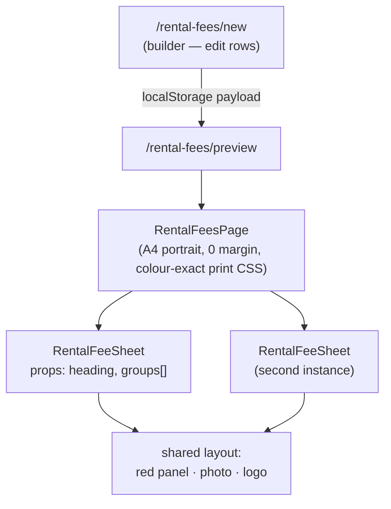

# feat: Rental fee forms — Your Fees Proposal & Statement and Tribunal Charges

**Source artwork:** `~/Downloads/28072026091539-0001.pdf` (2-page scan, A4 portrait, 150dpi render kept at `scratchpad/form-1.png`, `form-2.png`)

---

## Summary

Recreate two printed Grant's rental/property-management fee documents as print-ready
web sheets, following the existing `/marketing-plan` pattern exactly: a builder page
where the agent edits fee values, a preview route, and a print-only A4 portrait sheet.
Nothing is persisted to the database.

The two documents:

| Document | Content |
| --- | --- |
| **Your Fees Proposal** | Management fee, leasing fee, marketing package (3 rows) + 2 inclusion notes |
| **Statement and Tribunal Charges** | Two grouped lists — "Statements & Administration" (9 rows), "Tribunal and associated charges" (8 rows incl. one sub-note row) |

Both share one layout: full-bleed A4 portrait, solid brand-red left panel (~55% width),
photo bleeding off the right edge (~45%), letterspaced uppercase heading in the upper-left
third, fee rows mid-panel (label left, value right-aligned), outlined `grant's` logo bottom-left.

---

## Problem Frame

The agency has these two fee documents only as print artwork. They cannot be edited when
fees are negotiated, cannot be produced per-property, and do not live alongside the
marketing plan the agents already generate from the app. Recreating them in the app makes
them editable and printable from the same place as everything else.

**Not solving:** persisting rental fee data to proposals, embedding these into the
client-facing `/proposal/[id]` page, or emailing them. Print-only, standalone.

---

## Requirements

- **R1** — A standalone builder route lets an agent edit every fee label and value on both forms, seeded with the values printed on the source artwork.
- **R2** — Each form renders as a single A4 portrait page that prints via `window.print()` with no PDF dependency, matching the source artwork's layout, proportions, colour, and type treatment.
- **R3** — Both forms print from one action (a two-page print run), and each can be previewed on screen before printing.
- **R4** — Fee values render exactly as authored, including non-currency values (`6% plus gst`, `1.5 weeks plus gst`, `Included`) — the value column is free text, not a number.
- **R5** — The route is reachable from the same place the marketing-plan builder is (`ClientDetailsStep`, the landing entry card region).
- **R6** — Nothing is written to the database; no proposal record is required.

**Non-goals:** wizard integration, per-proposal saving, PDF library, editing the layout itself.

---

## Key Technical Decisions

**KTD1 — Mirror the `/marketing-plan` route triple rather than inventing a new pattern.**
`src/app/marketing-plan/{new,preview}/page.tsx` + `src/components/Marketing/{MarketingPlanPage,MarketingPlanSheet,MarketingPlanPrintButton}.tsx` is a working, shipped print pattern in this repo with print CSS already proven against the proposal's global A4-*landscape* `@page` rule. Copy its shape: builder page → `localStorage` payload → preview route → presentational sheet inside a print frame.

**KTD2 — Full-bleed sheet needs its own page frame, not `MarketingPlanPage`.**
`MarketingPlanPage` prints with `@page { margin: 14mm }` and a white content card. These forms bleed red and photo to all four edges. A sibling `RentalFeesPage` frame sets `@page { size: A4 portrait !important; margin: 0 !important; }` and `-webkit-print-color-adjust: exact` / `print-color-adjust: exact` so the red panel and photo actually render in print (browsers strip background colour by default). Reusing `MarketingPlanPage` would silently produce a white-margined, colour-stripped page.

**KTD3 — Fixed-aspect sheet sized in millimetres, not viewport units.**
Layout is `210mm × 297mm` with absolutely-positioned regions, scaled down on screen with a CSS `transform: scale()` wrapper. This makes screen preview and print output the *same* geometry — the one thing that makes "pixel perfect" verifiable. Percentage/viewport sizing would drift between the screen preview and the printed page, and Chrome's print media-query viewport quirk is already a captured lesson in `docs/solutions/`.

**KTD4 — Fee rows are `{ label, value, note? }`, value is a string.**
Per R4 the value column holds `6% plus gst`, `Included`, `$475 plus gst`. Typing it as a number and formatting would force the agency's exact wording through a formatter that cannot express it. The `note?` field carries the `- includes VCAT case preparation` sub-line under "VCAT Appearance".

**KTD5 — Heading typeface: Inter with wide tracking, pending the real font.**
The artwork's heading is a geometric sans with generous letterspacing, not the app's Playfair Display. Inter (already loaded) at `font-medium uppercase tracking-[0.18em]` is the closest available match. See Open Questions — if the agency names the real font, swapping it is a one-line change.

---

## High-Level Technical Design

Shared layout, two content shapes:



One sheet component renders both forms — they differ only in heading text and whether
the rows are one flat list (Fees Proposal) or two labelled groups (Tribunal Charges).
Modelling both as `groups: { title?: string; rows: FeeRow[] }[]` collapses the difference:
the Fees Proposal is a single untitled group.

Sheet geometry (mm, from the source artwork):

```
┌──────────────────────────────────────┬─────────────────┐
│  red #C41E2A  (0 → ~116mm)           │  photo, bleeds  │
│                                      │  off right edge │
│   ~34mm ┌ HEADING (uppercase,        │                 │
│         │ tracked, 2–3 lines)        │                 │
│                                      │                 │
│   ~112mm┌ group title (optional)     │                 │
│         │ label ............. value  │  ← right-align  │
│         │ label ............. value  │    the value    │
│         │ note (smaller, indented)   │                 │
│                                      │                 │
│   ~228mm┌ grant's logo (outlined,    │                 │
│         │ slight rotation)           │                 │
└──────────────────────────────────────┴─────────────────┘
```

---

## Implementation Units

### U1. Shared types and default fee data

**Goal:** One module owning the fee-row shape and the two forms' printed defaults.

**Requirements:** R1, R4

**Dependencies:** none

**Files:**
- `src/lib/rental-fees.ts` (create)
- `src/lib/rental-fees.test.ts` (create)

**Approach:**
1. Export `FeeRow { label: string; value: string; note?: string }` and `FeeGroup { title?: string; rows: FeeRow[] }`.
2. Export `DEFAULT_FEES_PROPOSAL: FeeGroup[]` — one untitled group: Management Fee / `6% plus gst`, Leasing fee / `1.5 weeks plus gst`, Marketing package / `$300`. Plus `FEES_PROPOSAL_NOTES: string[]` — `Premiere Listing Australia's No 1 website`, `Professional daytime photoshoot` (these render smaller, under the rows, with no value column).
3. Export `DEFAULT_TRIBUNAL_CHARGES: FeeGroup[]` — two groups, transcribed verbatim from the artwork (see Appendix).
4. Export `rentalFeesTitle(address?)` for the print document title, mirroring `marketingPlanTitle` in `src/lib/marketing-plan.ts`.

**Patterns to follow:** `src/lib/marketing-plan.ts` — same export style, same `…Title(address)` helper convention.

**Test scenarios:**
- `DEFAULT_FEES_PROPOSAL` flattens to exactly 3 rows with the labels and values printed on page 1.
- `DEFAULT_TRIBUNAL_CHARGES` has 2 groups titled `Statements & Administration:` and `Tribunal and associated charges`, with 9 and 7 rows respectively.
- The `VCAT Appearance` row carries `note: '- includes VCAT case preparation'`.
- `rentalFeesTitle('12 Smith St, Berwick')` includes the address; `rentalFeesTitle(undefined)` returns a sensible fallback with no `undefined` in the string.

---

### U2. `RentalFeeSheet` — the pixel-perfect A4 sheet

**Goal:** One presentational component that renders either form at exact A4 geometry.

**Requirements:** R2, R4

**Dependencies:** U1

**Files:**
- `src/components/RentalFees/RentalFeeSheet.tsx` (create)

**Approach:**
1. Props: `{ heading: string; groups: FeeGroup[]; notes?: string[]; photoSrc?: string }`.
2. Root is a `210mm × 297mm` relatively-positioned block, `overflow: hidden`, background `#C41E2A`.
3. Photo is absolutely positioned right, `left: 55%; right: 0; top: 0; bottom: 0`, `object-fit: cover`. The supplied original is **landscape with the subject right-of-centre**, so the crop must favour the right: `object-position: 72% center` (tune against the artwork — the artwork's crop starts just left of her shoulder and runs off the right edge). Falls back to plain red when `photoSrc` is absent so the sheet is never broken while awaiting the asset (U5).
4. Heading: absolute at ~`left: 34mm; top: 80mm`, uppercase, `tracking-[0.18em]`, `leading-[1.35]`, white, ~24pt.
5. Groups: absolute block starting ~`top: 112mm` (Tribunal) / `~118mm` (Fees Proposal — fewer rows, sits lower in the artwork). Each group renders an optional title (semibold, ~11pt, `mb-1.5`), then rows as a two-column grid: label left, value right-aligned, both ~10.5pt, `leading-[1.55]`. A `note` renders as its own full-width row in the same size, no value.
6. Notes (`notes?`) render under the rows at ~8.5pt semibold — matching the two small lines on page 1.
7. Logo: absolute at ~`left: 30mm; bottom: 40mm`, `/images/grants-logo.svg`, ~52mm wide.
8. All colours as literal hex (`#C41E2A`, `#FFFFFF`) not Tailwind theme tokens — a print sheet must not shift if the theme changes.

**Technical design** (directional):

```tsx
<div className="rf-sheet relative w-[210mm] h-[297mm] overflow-hidden bg-[#C41E2A] text-white">
  
  <h1 className="absolute left-[34mm] top-[80mm] w-[75mm] uppercase tracking-[0.18em] …" />
  <div className="absolute left-[34mm] top-[112mm] w-[78mm]">…groups…</div>
  
</div>
```

**Patterns to follow:** `src/components/Marketing/MarketingPlanSheet.tsx` — presentational-only, no client hooks, literal hex colours, `eslint-disable @next/next/no-img-element` on raw ``.

**Test scenarios:**
- Renders the heading text passed in, uppercased in the DOM output.
- Renders every row label and value from a two-group fixture, values in the right-hand column.
- A row with `note` renders the note text as its own line, with no value beside it.
- `notes` array renders below the last group; omitting it renders nothing extra.
- Omitting `photoSrc` renders no `` for the photo and does not throw.

---

### U3. `RentalFeesPage` print frame + print button

**Goal:** Full-bleed, colour-exact, A4-portrait print behaviour that does not leak into the proposal's landscape print styles.

**Requirements:** R2, R3

**Dependencies:** U2

**Files:**
- `src/components/RentalFees/RentalFeesPage.tsx` (create)
- `src/components/RentalFees/RentalFeesPrintButton.tsx` (create)

**Approach:**
1. `RentalFeesPage({ children, documentTitle })` renders a grey screen background, the fixed print button (`print:hidden`), and the children.
2. Scoped print CSS via `<style dangerouslySetInnerHTML>`, mirroring `MarketingPlanPage` but for full bleed:
   - `@page { size: A4 portrait !important; margin: 0 !important; }`
   - `html, body { background: #fff !important; }`
   - `.rf-sheet { -webkit-print-color-adjust: exact !important; print-color-adjust: exact !important; break-after: page; }`
   - `.rf-sheet:last-child { break-after: auto; }` so two sheets print as exactly two pages, not three.
3. On screen, wrap each sheet in a `transform: scale()` container so a 210mm sheet fits a normal viewport; the transform is removed under `@media print`.
4. Print button copies `MarketingPlanPrintButton` — sets `document.title` to `documentTitle` before `window.print()` and restores it after, so the browser's PDF filename is meaningful.

**Execution note:** Verify in Chrome's actual print preview, not just DevTools print emulation — `docs/solutions/` records that Chrome's print media-query viewport differs from the emulated one, which is exactly the failure mode this frame is exposed to.

**Patterns to follow:** `src/components/Marketing/MarketingPlanPage.tsx` and `MarketingPlanPrintButton.tsx`.

**Test scenarios:**
- Renders children and the print button.
- The emitted `<style>` block contains `size: A4 portrait` and `margin: 0`.
- The emitted `<style>` block contains both `-webkit-print-color-adjust: exact` and `print-color-adjust: exact`.
- Print button click sets `document.title` to the passed `documentTitle`, calls `window.print()`, and restores the original title (spy on `window.print`).

---

### U4. Builder and preview routes

**Goal:** Agent edits the fee rows, previews both sheets, prints.

**Requirements:** R1, R3, R5, R6

**Dependencies:** U1, U2, U3

**Files:**
- `src/app/rental-fees/new/page.tsx` (create)
- `src/app/rental-fees/preview/page.tsx` (create)
- `src/components/Wizard/steps/ClientDetailsStep.tsx` (modify — add the entry link beside the existing `/marketing-plan/new` link at line ~849)

**Approach:**
1. **Builder** (`/rental-fees/new`, client component): optional `AddressAutocomplete` for property context (reuse the export from `ClientDetailsStep`, as `marketing-plan/new` does), then a simple editor — two sections, each group rendering its rows as `label` / `value` text inputs, with add-row and remove-row per group. State seeded from `DEFAULT_FEES_PROPOSAL` / `DEFAULT_TRIBUNAL_CHARGES`. No new form library; controlled inputs only.
2. A "preview / print fee forms" button writes `{ feesProposal, tribunalCharges, notes, propertyAddress }` to `localStorage` under `gea:rental-fees-preview` and opens `/rental-fees/preview` in a new tab — same mechanism and same fallback-to-`sessionStorage` read as the marketing-plan preview.
3. **Preview** (`/rental-fees/preview`, client component): reads the payload, renders `RentalFeesPage` containing two `RentalFeeSheet`s. Shows the same style of empty state as `marketing-plan/preview` when the payload is missing or malformed.
4. Add a link to `/rental-fees/new` next to the existing marketing-plan link in `ClientDetailsStep`.

**Patterns to follow:** `src/app/marketing-plan/new/page.tsx` (builder shell, back link, header) and `src/app/marketing-plan/preview/page.tsx` (storage read, `loaded` guard, empty state).

**Test scenarios:**
- Builder renders every default row from both forms as editable inputs on first paint.
- Editing a value input updates that row's value in the payload written to storage.
- Add-row appends an empty row to the correct group only; remove-row removes the right row and leaves siblings intact.
- Preview with no stored payload renders the empty state and does not throw.
- Preview with a malformed (non-JSON) stored payload renders the empty state rather than crashing.
- Preview with a valid payload renders two `.rf-sheet` elements with the two expected headings.

---

### U5. Photo asset

**Goal:** Wire the real photograph in.

**Requirements:** R2

**Dependencies:** U2

**Files:**
- `public/images/rental-fees-hero.jpg` (create — **supplied by Stuart**, high-res landscape original, not generated)

**Approach:**
1. Save the supplied original to `public/images/rental-fees-hero.jpg`.
2. Pass it as `photoSrc` from the preview route.
3. Tune `object-position` against the artwork. The original is landscape (~3:2) with the subject right-of-centre against a linen-textured wall; the sheet shows only the right ~45% of an A4 portrait, so the visible crop is roughly the right third of the original. Start at `72% center` (U2) and adjust until her shoulder line and the wall/dark-edge boundary sit where they do on the printed page.

U2 renders correctly without the asset, so this unit is independent and can land last.

**Test expectation:** none — asset drop-in plus a visual tune; covered by the Verification Contract's overlay gate, not a unit test.

---

## Verification Contract

- `npx tsc --noEmit` clean.
- `npm run lint` clean.
- Unit tests for U1–U4 pass.
- **Visual gate (the real one):** open `/rental-fees/preview` with defaults, print to PDF in Chrome, and compare page-for-page against `~/Downloads/28072026091539-0001.pdf`. The output must be exactly two A4 portrait pages, red bleeding to all four edges, photo bleeding off the right, no white margins, all rows present. Overlay the printed PDF against the source at 50% opacity to check heading position, row baseline rhythm, and logo placement.

## Definition of Done

Both forms print from `/rental-fees/new` as a two-page A4 portrait PDF that a reader
cannot readily distinguish from the printed originals; every fee label and value is
editable before printing; nothing was added to the database; the proposal page's own
landscape print output is unchanged.

---

## Risks & Dependencies

| Risk | Mitigation |
| --- | --- |
| Browser strips background colour in print — sheet prints white | `print-color-adjust: exact` in U3; the visual gate catches it. The user may still need "Background graphics" ticked in Chrome's print dialogue — note this in the builder UI. |
| Global `@page { size: A4 landscape }` in `globals.css` leaks into these routes | U3's `!important` portrait override, same technique already proven in `MarketingPlanPage`. Verify the proposal print output is still landscape after this lands. |
| Screen preview and print geometry diverge | KTD3's fixed-mm sheet + scale transform; Chrome print-preview verification per U3's execution note. |
| Heading typeface is not the artwork's font | Tracked as an open question; Inter substitution is visually close and swappable in one line. |

---

## Open Questions

- **What is the heading typeface on the printed artwork?** Deferred, not blocking — U2 ships with Inter + wide tracking (KTD5). If the agency's brand guide names the real font and it is available on Google Fonts, swap it in `RentalFeeSheet`.
- **Should the Fees Proposal seed from a rental proposal's `managementFee` / `lettingFee`?** Those fields already exist on the wizard. Out of scope here (R6 — standalone, no DB), but a natural follow-up if agents end up double-entering.

---

## Deferred to Follow-Up Work

- Embedding these sheets in the client-facing `/proposal/[id]` page for rental proposals.
- Persisting rental fee values per-proposal.
- Attaching the forms to the approval email.

---

## Appendix — verbatim fee data from the artwork

**Page 1 — YOUR FEES PROPOSAL**

| Label | Value |
| --- | --- |
| Management Fee | 6% plus gst |
| Leasing fee | 1.5 weeks plus gst |
| Marketing package | $300 |

Notes (smaller, no value column):
`Premiere Listing Australia's No 1 website` · `Professional daytime photoshoot`

**Page 2 — STATEMENT AND TRIBUNAL CHARGES**

*Statements & Administration:*

| Label | Value |
| --- | --- |
| End of Financial Statement preparation | Included |
| National Tenancies Database checks | $20 plus gst |
| Registered Mail Notices | $6 plus gst |
| Lease Renewal | $65 plus gst |
| Rent Increase | $75 plus gst |
| Routine Inspection | $60 plus gst |
| Final Inspection | $70 plus gst |
| Compliance Checks  Administration | $50 plus gst |
| Admin / Technology charge | $2 plus gst |

*Tribunal and associated charges*

| Label | Value |
| --- | --- |
| VCAT Appearance *(note: `- includes VCAT case preparation`)* | $475 plus gst |
| VCAT Application | $90 plus gst |
| Bond & Compensation Application | $90 plus gst |
| Warrant of Possession & Attendance | $470 plus gst |
| Fencing Management | $275 plus gst |
| Insurance Claim Management | $275 plus gst |
| Project Management for Refurbishment | $275 plus gst |

> `Compliance Checks  Administration` has a double space in the original — transcribed verbatim.

---

## Sources & Research

- Source artwork: `~/Downloads/28072026091539-0001.pdf` (scanned, no text layer; read via `pdftoppm` render)
- Hero photograph: original supplied by Stuart, 2026-07-28 — landscape, subject right-of-centre, linen-wall background. Lands at `public/images/rental-fees-hero.jpg` (U5).
- Pattern reference: `src/components/Marketing/MarketingPlanSheet.tsx`, `MarketingPlanPage.tsx`, `MarketingPlanPrintButton.tsx`
- Route reference: `src/app/marketing-plan/new/page.tsx`, `src/app/marketing-plan/preview/page.tsx`
- Prior lesson: `docs/solutions/` — Chrome print media-query viewport differs from DevTools emulation (captured in commit `be6f118`)
