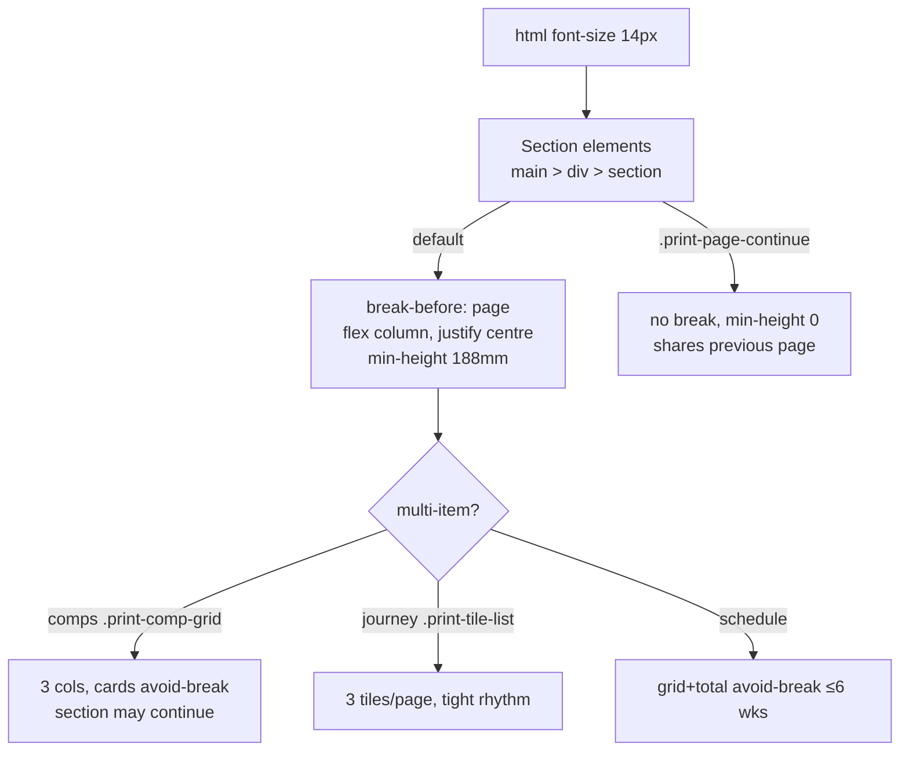

# fix: A4 Landscape Print — Fill Pages and Fix Pagination

## Summary

The full sale proposal already prints as A4 landscape with a full-bleed cover, one section per page, 10mm margins and a running header (`src/styles/globals.css` `@media print`, plans `2026-07-07-002` and `2026-07-15-001`). A headless-Chrome print of a real proposal (`5c3d2b6c…`, 6 sold + 6 on-market comps, 5-week schedule) produced **24 pages** with no clipping or overlap, but with two presentation defects that make it read as unfinished when hand-delivered:

1. **Under-filled pages** — roughly 11 of 24 pages carry a strip of small type across the top third and blank paper below (your property, price statement, agent profile, stats bar, campaign strategy, reaching buyers, internet, team, investment, closing). Cause: the global 12px print root shrinks screen-designed sections while one-section-per-page hands each a full sheet.
2. **Bad pagination on the multi-item sections** — comparables spill 2 orphan cards to a near-empty page (4-up grid, 6 cards); the 6-step journey breaks 1/2/2/1 across four pages; the advertising schedule strands weeks 2–4 and the total on a second page.

This plan fixes fill and pagination through print CSS plus small print-only class changes in four components, then verifies with the existing headless-print harness. Target: the same content on ≤ 16 pages, every page visibly composed, no orphans, cover unchanged.

Product Contract preservation: n/a — direct planning, no upstream requirements doc.

---

## Problem Frame

- The PDF is the hand-delivered artefact; whitespace-heavy pages and stranded cards undermine a "premium presentation" more than any on-screen flaw.
- Print rules live in one place (`@media print` in `src/styles/globals.css`) keyed on `.proposal-print-root`; components opt in via `print:` Tailwind variants and hook classes (`print-comp-grid`, `print-tile-list`, `print-page-continue`, `print-drop`).
- Express (`SimpleProposal.tsx`) and the short PDF (`.print-short`) share the same rules and must not regress.

Evidence: `scratchpad/print/full.pdf` (24 pp, 841.92 × 594.96 pt) and its contact sheet, produced from `main` @ `9f53997`.

---

## Requirements

- **R1** — No section prints as a top-third strip over blank paper: short sections either fill the page (larger type, vertically centred content) or share a page with an adjacent short section.
- **R2** — Comparables (sold and on-market, full and dual/dev variants) print at most 6 cards per page in a 3 × 2 grid; no card splits. Sets of ≤ 6 fit on one page; 7–12 take two, with the remainder (1–6 cards) on the second page.
- **R3** — Process journey prints 3 steps per page (6 steps → 2 pages, 7 → 3), tiles never split.
- **R4** — Advertising schedule (2-column week grid, week 0 = campaign preparation, then a total row) prints on one page for up to 6 week cards; beyond that it may break between grid rows, and the total never strands on its own page.
- **R5** — Cover page unchanged (full-bleed 209mm, no header); running header, 10mm margins and page size unchanged.
- **R6** — Body text is not smaller than today at print (≥ 12px root; the plan raises it).
- **R7** — Short PDF (`.print-short`) still prints each comparables section on exactly one page and still drops `.print-drop` sections; Express prints without regressions.
- **R8** — A repeatable verification path exists: print full, short and Express via `scripts/print-proposal-pdf.sh`, rasterise, and check page count + per-page ink coverage.

---

## Key Technical Decisions

- **KTD1 — Fill by scale + centring, not by re-ordering content.** Raise the print root to 14px and give every non-cover section `display:flex; flex-direction:column; justify-content:center; min-height: 100%` of the page body (A4 landscape body at 10mm margins = 190mm; use 188mm for 2mm safety) so short content sits mid-page rather than at the top. Rationale: keeps section order and copy identical to screen; a 14px root still leaves the 4-up comps and tables inside the page width (verified at 12px with room to spare).
- **KTD2 — Pair known-short sections onto shared pages with the `print-page-continue` opt-out, extended to cover `.print-drop`-nested sections.** Today's selector only matches `main > div > section.print-page-continue`; StatsBar, InternetPresence and ClosingStatement all sit inside `.print-drop` wrappers, so the selector (and the `:has(+ …)` fill-drop on the preceding section) must also match `main > div > .print-drop > section.print-page-continue`. Pairs are static and always-present: **stats bar → under agent profile**; **team showcase → under internet presence** (VIPBuyers is conditional per property type, so Internet is not paired upward); **closing statement → under investment** (always; if a pair overflows it breaks internally, no worse than today). The class is added directly to each component's root `<section>` (print-only hook, no screen effect) — never via a wrapper div, which would break the `main > div > section` selectors. Paired sections get `min-height: 0`; the preceding section drops its fill.
- **KTD3 — Comparables 3 × 2 per page via CSS only.** Change `print:grid-cols-4` → `print:grid-cols-3` on both grids, keep `.print-comp-grid > *` `break-inside: avoid`, and let the section break internally (already `break-inside: auto`). Six cards → one page; the short-PDF cap moves from `nth-child(n+5)` to `nth-child(n+7)` so the short variant fills its single page. Rationale: 3 columns at 14px root fit the 277mm body width with the same card proportions as screen `lg`.
- **KTD4 — Journey and schedule get print-specific spacing, not new layouts.** `ProcessJourney`: tile height is set by the `aspect-[4/3]` image wrapper (not the ``), so cap the wrapper at print (`aspect-ratio: auto; height: 55mm`, placeholder numeral scaled down), tighten `print-tile-list` rhythm to 1rem, keep per-tile `break-inside: avoid` — 3 tiles fit a page. `AdvertisingSchedule`: reduce card padding/line spacing at print, keep the total block `break-before: avoid` so it stays with the last row; wrap grid + total in `break-inside: avoid` only when ≤ 6 week cards (Chrome ignores avoid if the block cannot fit, so this degrades safely). Rationale: minimal, predictable, no JS.
- **KTD5 — Verification is script-driven and stays out of the app.** Extend `scripts/print-proposal-pdf.sh` with a `--sheet` flag that rasterises pages (pdftoppm) and reports per-page content coverage. Because many sections paint a full-page tint (`bg-off-white`, `bg-charcoal-900`, …) once they fill the page, "ink" is measured **relative to each page's dominant colour**: a row counts as content only if > 5% of its pixels differ from the page mode by ΔL > 25 (greyscale). Fail if any non-cover page has < 35% of body-height rows with content. Rationale: the defect is visual; a background-independent number makes regressions catchable in review.

---

## High-Level Technical Design

Page budget after change (from the 24-page sample): cover 1 · your property 1 · price/method 1 · agent+stats 1 · strategy 1 · why private sale 1 · sold comps 1 · on-market comps 1 · reaching buyers 1 · internet + team 1 · journey 2 · how we market 1 · schedule 1 · investment + closing 1 · footer 1 ≈ **16 pages**.

---

## Implementation Units

### U1. Print root scale and section fill

**Goal:** Every non-cover section occupies its page with vertically centred content; paired short sections share a page.
**Requirements:** R1, R5, R6
**Dependencies:** none
**Files:** `src/styles/globals.css`; `src/components/Proposal/StatsBar.tsx`, `src/components/Proposal/TeamShowcase.tsx`, `src/components/Proposal/ClosingStatement.tsx` (add `print-page-continue` to each root `<section>`; do not wrap — see KTD2)
**Approach:**
1. `html { font-size: 14px }` in `@media print` (fall back to 13px if U5 shows any horizontal overflow).
2. Section fill rule scoped to **non-cover** sections only — `main > div > section:not(:first-child)` and `main > div > .print-drop section`: `display:flex; flex-direction:column; justify-content:center; min-height:188mm` (page 210 − 2×10 margins − 2mm safety); keep padding 8mm; keep `break-inside:auto` so long sections still continue. Remove the existing `min-height: 0 !important` from that shared block (the `.min-h-screen/.h-screen` reset already handles viewport heights) or the fill is silently defeated.
3. Continue rule, both nesting depths: `main > div > section.print-page-continue, main > div > .print-drop > section.print-page-continue { break-before:auto; min-height:0 }`. Preceding-section fill drop: `section:has(+ section.print-page-continue), section:has(+ .print-drop > section.print-page-continue:first-child) { min-height:0; justify-content:flex-start }`. `:has()` is supported by headless Chrome and Safari 15.4+; if unsupported the pair still prints, only the preceding section keeps its centring.
4. Add `print-page-continue` to the root `<section>` of StatsBar, TeamShowcase and ClosingStatement (KTD2 pairs). InternetPresence is also rendered inline in the dual-campaign dev block; unaffected because it is not the continuing element.
5. Confirm the cover (`section:first-child`, 209mm, no padding, no flex) is pixel-identical to today's page 1.
**Patterns to follow:** existing `.proposal-print-root main > div > section` block; `.print-page-continue` opt-out.
**Test scenarios:**
- Print sample proposal: page 2 ("your property") text block sits vertically centred; content coverage ≥ 35% of body height.
- Agent profile + stats bar on one page; internet + team on one page; investment + closing on one page.
- Land and commercial property types (VIPBuyers hidden, comparables waived) still print with no top-strip page.
- Short PDF (`.print-drop` hidden) unaffected — its pairs simply disappear with their sections.
- Cover still full-bleed with no header, pixel-identical to today.
- Express proposal prints without any section overflowing to a second page purely due to the larger root; no horizontal overflow on any page.
**Verification:** contact sheet shows no top-third-strip pages; page count ≤ 16 once U2–U4 land (U1 alone will be higher — that is expected).

### U2. Comparables 3 × 2 print grid

**Goal:** Sold and on-market comparables print six per page with no orphans.
**Requirements:** R2, R7
**Dependencies:** U1
**Files:** `src/components/Proposal/RecentSales.tsx`; `src/components/Proposal/OnMarketListings.tsx`; `src/styles/globals.css` (short-mode cap)
**Approach:**
1. `print:grid-cols-4` → `print:grid-cols-3`, `print:gap-4` kept.
2. Add `.print-comp-grid > * { break-inside: avoid }` (cards) and `.print-comp-grid { orphans/widows n/a }` — rely on grid rows breaking between rows.
3. Short mode: `nth-child(n + 5)` → `nth-child(n + 7)`.
4. Card image height at print capped on the image **container** (check whether cards use an aspect-ratio box like ProcessJourney; cap the box, not the ``) so two rows plus heading fit 188mm.
**Patterns to follow:** existing `print-comp-grid` hook.
**Test scenarios:**
- 6 sold + 6 on-market → each section exactly one page.
- 8 comps → page 1 has 6, page 2 has 2 (R2) — confirm no card is cut.
- 4 comps → single page, one full row + one card row.
- Short PDF: comparables section is exactly one page with 6 cards.
- Dual-campaign dev comparables section (page.tsx line ~227) inherits the same behaviour.
**Verification:** no page in the comps range holds fewer cards than R2 allows; short PDF page count unchanged or lower.

### U3. Process journey rhythm

**Goal:** Three journey tiles per page, tiles never split.
**Requirements:** R3
**Dependencies:** U1
**Files:** `src/components/Proposal/ProcessJourney.tsx`; `src/styles/globals.css`
**Approach:**
1. `.print-tile-list` gap/margins 1.5rem → 1rem; cap the tile's `aspect-[4/3]` image wrapper at print (`aspect-ratio:auto; height:55mm`; `` stays `h-full object-cover`; scale the placeholder numeral); tile text sizes unchanged.
2. Heading block stays with the first tile (`break-after: avoid` on the header wrapper).
3. If 3 tiles still overflow at 14px, reduce the wrapper to 48mm before touching type.
**Patterns to follow:** `.print-tile-list > *` avoid-break rule.
**Test scenarios:**
- 6 steps → 2 pages of 3.
- 7 steps (off-market stage on) → 3 pages (3/3/1), heading on page 1 with tiles.
- No tile image clipped or split.
**Verification:** journey pages in the contact sheet each show 3 tiles (last may show fewer).

### U4. Advertising schedule on one page

**Goal:** Prep column, week cards and total print together for ≤ 6 weeks.
**Requirements:** R4
**Dependencies:** U1
**Files:** `src/components/Proposal/AdvertisingSchedule.tsx`; `src/styles/globals.css`
**Approach:**
1. Reduce card padding and line spacing at print (`print:p-3`, `print:space-y-1`); total block gets `break-before: avoid`.
2. Grid stays 2 columns at print (week 0 = preparation card, then weeks); for ≤ 6 cards wrap grid + total in a `print:break-inside-avoid` div; beyond that Chrome breaks between grid rows and the total stays with the last row. If the 5-week sample still overflows at 14px, compress item rows before touching type.
**Patterns to follow:** section-internal `break-inside` conventions already used for `tr`.
**Test scenarios:**
- 5-week sample → one page, total visible under the cards.
- 8-week schedule → two pages, total on the same page as the last week card.
- Included/priced items still legible (no text under 9pt).
**Verification:** schedule never leaves the total alone on a page.

### U5. Verification harness

**Goal:** Repeatable measurement of page count and per-page fill.
**Requirements:** R8
**Dependencies:** none (used to verify U1–U4)
**Files:** `scripts/print-proposal-pdf.sh` (add `--sheet`); `scripts/print-fill-report.py` (new; pdftoppm + Pillow ink-coverage per page → table + contact sheet)
**Approach:**
1. `--sheet` runs pdftoppm at 50dpi into a temp dir, then the Python report prints page, content-row %, and warns for non-cover pages < 35%. Content is measured against each page's dominant colour (KTD5) so tinted full-page backgrounds do not read as filled.
2. Document usage at the top of the script (full, `--short`, Express id).
**Patterns to follow:** existing script header/usage style.
**Test scenarios:**
- Running on the current `main` PDF reports ~11 under-filled pages; after U1–U4 reports 0.
- `--short` variant reports comps sections as single pages.
- A page with a solid tinted background and one line of text reports low coverage (metric is background-independent).
**Verification:** report runs from a clean checkout with Chrome + poppler + Pillow present; states clearly if a dependency is missing.
**Execution note:** Do U5 first — it is the proof for every other unit.

---

## Scope Boundaries

- No copy, ordering or component restructuring on screen; screen layout must be pixel-identical.
- No portrait mode, no A3, no per-agent print preferences.
- Hero/photo sourcing (the local sample printed a placeholder cover pattern) is a data issue outside this plan.
- Marketing-plan and rental-fee print sheets (`MarketingPlanSheet`, `RentalFees*`) are separate print roots and untouched.

### Deferred to Follow-Up Work
- Optional "presentation pack" ordering (merge investment into the closing page, drop team page for Express) — needs a product call.
- Page numbers in the running footer.

---

## Risks & Dependencies

- **14px root may push wide tables/grids past 277mm** — mitigated by U5 measurement and by trialling 13px if any section overflows horizontally.
- **`:has()` fallback** — if unsupported by the print engine in use, paired sections still print correctly, only the preceding section keeps its fill (cosmetic).
- **Framer-motion inline styles** are already neutralised at print; new flex centring must not reintroduce `opacity: 0` states.
- Depends on Chrome (headless) for verification; user-side "save pdf" uses the browser's print engine — Safari should be spot-checked once.

---

## Sources & Research

- Print CSS: `src/styles/globals.css` `@media print` block; hooks `print-comp-grid`, `print-tile-list`, `print-page-continue`, `print-drop`.
- Prior plans: `docs/plans/2026-07-07-002-fix-pdf-a4-landscape-plan.md`, `docs/plans/2026-07-15-001-feat-short-print-pdf-variant-plan.md`.
- Sample evidence: 24-page headless print of proposal `5c3d2b6c5204d816db2eeba22939a127` on `main` @ `9f53997` (scratchpad `print/full.pdf`, `sheet.png`, `zoom.png`).
