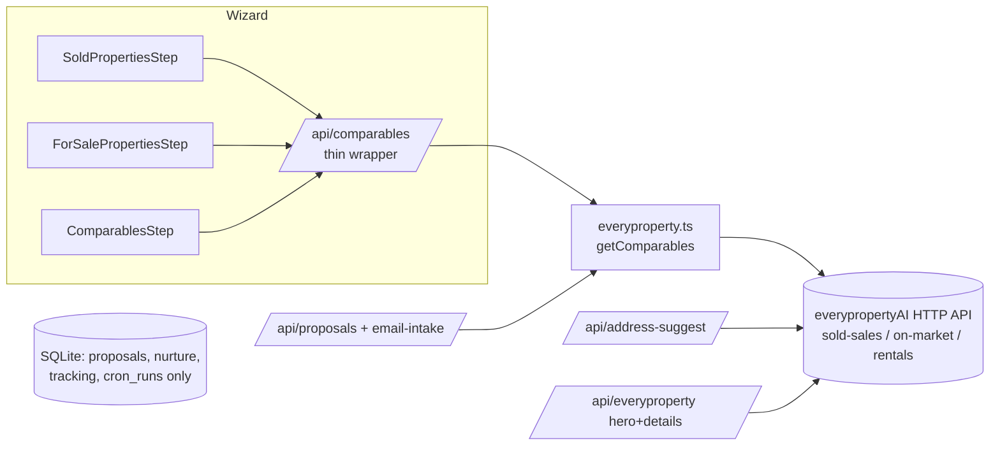

# refactor: everypropertyAI as single property-data source

## Summary

Remove the proposals app's local scraped property-data layer (SQLite property tables, Firecrawl/Apify/homely scrapers, and the cron jobs that feed them) and fetch all sold comparables, on-market, leased, and rental listings live from the everypropertyAI HTTP API. SQLite remains for proposals, tracking, nurture, and email intake only. everypropertyAI already provides `/api/sold-sales`, `/api/on-market-listings`, `/api/proposal`, and `/api/search` with accurate per-property coordinates, so this is mostly deletion and rewiring.

---

## Problem Frame

The app maintains a parallel copy of property data (2,900+ rows across 5 SQLite tables) fed by 7 scraping cron jobs, with its own geocoding backfill — all duplicating what the everypropertyAI backend already owns. The duplicate is stale, partially geocoded (was causing the distance-filter leak), diverges between dev and Railway, and carries heavy maintenance cost (Firecrawl rate limits, Apify quirks, rotating refresh schedules). The user's decision: everypropertyAI *is* the database; the proposals app should hold no separate property data.

## Requirements

- R1. All wizard property searches (sold, buy, leased, rent) fetch from the everypropertyAI API; no reads from local property tables.
- R2. The SQLite property tables (`sold_properties`, `leased_properties`, `for_rent_properties`, `cached_properties`, `cache_metadata`) and their schema, indexes, and migrations are removed. Proposals/tracking/nurture/cron-log tables stay.
- R3. All property-scraping code, scripts, cron jobs, and their API routes are deleted (session-settled: user-directed — chosen over keep-as-fallback: everypropertyAI owns data collection).
- R4. When everypropertyAI is slow or returns nothing, the wizard shows an empty state with a clear message; it never blocks on the ~120s uncached path (session-settled: user-directed — chosen over block-until-data).
- R5. Server-side proposal generation (`/api/proposals`, email intake) uses the same everypropertyAI source as the wizard.
- R6. Distance filtering keeps the strict semantics just shipped: listings without coordinates are excluded when a distance filter is active.

---

## Key Technical Decisions

- KTD1. **Extend `getComparables` for rentals.** everypropertyAI's surface includes rental listings (`rental_listings` on its MCP). Add `'leased' | 'rent'` branches to `src/lib/everyproperty.ts` calling the corresponding HTTP endpoint (expected `/api/rental-listings`; verify actual path/params against the everypropertyAI service before wiring — see Open Questions).
- KTD2. **`/api/comparables` becomes a thin wrapper.** One route, four types, all delegating to `getComparables` across the subject suburb + `NEIGHBORING_SUBURBS`, deduped. No cache tier, no scrape fallback, no `refresh=true` re-scrape path (a refresh just re-fetches).
- KTD3. **Keep `parseAddress` and `NEIGHBORING_SUBURBS`** by moving them out of `comparables-lookup.ts` into a small `src/lib/address-utils.ts` (or similar) before deleting the rest.
- KTD4. **Keep `/api/geocode` (Nominatim)** for subject-property centroid fallback; comps no longer need per-row geocoding since everypropertyAI carries lat/lng.
- KTD5. **No local caching layer in v1.** Rely on everypropertyAI's own caching. If suburb queries prove slow in practice, add a short-TTL in-memory cache later — deferred, not built now.

## High-Level Technical Design

Deleted entirely: property-cache tier, Firecrawl/Apify/homely scrapers, 7 property cron jobs, geocode backfill, import/scrape/cache routes.

---

## Implementation Units

### U1. Add rental/leased support to the everypropertyAI client

**Goal:** `getComparables` covers all four listing types.
**Requirements:** R1 (leased/rent), KTD1.
**Dependencies:** none.
**Files:** `src/lib/everyproperty.ts`.
**Approach:** Probe the everypropertyAI service for its rental endpoint (path + response shape), add `'leased' | 'rent'` to the `type` union, map rows to `EveryPropertyComp` mirroring the on-market mapping. Return `[]` on error, as the existing branches do.
**Test scenarios:**
- `getComparables('Berwick', 'rent')` returns mapped rows with lat/lng from a stubbed response.
- Unknown suburb / API error returns `[]`, not a throw.
- Price outlier filtering applied consistently with existing branches.
**Verification:** `npx tsc --noEmit` clean; a quick script call against the live API returns rows for a known suburb.

### U2. Collapse `/api/comparables` to an everypropertyAI-only wrapper

**Goal:** One code path for all four types; no local DB, cache, or scrape fallbacks.
**Requirements:** R1, R4, R5, KTD2, KTD3.
**Dependencies:** U1.
**Files:** `src/app/api/comparables/route.ts`, `src/lib/comparables-lookup.ts` (gut), new `src/lib/address-utils.ts`, `src/app/api/proposals/route.ts`, `src/lib/email-intake.ts`.
**Approach:**
1. Move `parseAddress` + `NEIGHBORING_SUBURBS` to `address-utils.ts`; update importers.
2. Rewrite `/api/comparables` to: parse address → suburb + neighbours → `getComparables` per suburb → dedupe → return. Drop `source=local`, scrape fallbacks, and `refresh` re-scrape semantics (refresh = plain re-fetch).
3. Point `/api/proposals` and `email-intake.ts` at the same helper instead of `lookupComparables`/`lookupOnMarket`.
**Test scenarios:**
- `type=sold|buy|leased|rent` each return rows for a seeded/stubbed suburb.
- API failure returns `{ results: [] }` with 200 (wizard shows empty state), not a 500.
- Neighbour-suburb results are included and deduped by address.
**Verification:** wizard steps 4–5 load results end-to-end against the live API in dev.

### U3. Remove scraper/backfill client calls from the wizard

**Goal:** Wizard no longer calls deleted endpoints; empty results show a clear message.
**Requirements:** R1, R4, R6.
**Dependencies:** U2.
**Files:** `src/components/Wizard/steps/SoldPropertiesStep.tsx`, `src/components/Wizard/steps/ForSalePropertiesStep.tsx`, `src/components/Wizard/steps/ComparablesStep.tsx`.
**Approach:** Remove `POST /api/comparables/geocode` refinement calls and `POST /api/scrape-sold`/`/api/scrape-leased` zero-result fallbacks; replace the fallback with the empty-state message ("no listings found via everypropertyAI — try a wider distance"). Keep the strict distance filter and `/api/geocode` subject fallback.
**Test scenarios:**
- Zero results renders the empty-state message, no network call to scrape endpoints.
- Distance filter still excludes coordinate-less rows (regression guard on the just-shipped fix).
**Verification:** run the wizard in dev; network tab shows only `/api/comparables`, `/api/geocode`, `/api/address-suggest`, `/api/everyproperty`.

### U4. Delete scrapers, crons, and dead routes

**Goal:** All property-data collection code is gone.
**Requirements:** R3.
**Dependencies:** U2, U3 (nothing references the deleted modules).
**Files:** delete `src/lib/firecrawl-scraper.ts`, `src/lib/apify-scraper.ts`, `src/lib/onmarket-scraper.ts`, `src/lib/rental-scraper.ts`, `src/lib/agent-scraper.ts`, `src/lib/cache-refresh.ts`, `src/lib/geocode-backfill.ts`, `src/lib/property-cache.ts`, `scripts/backfill-coords.ts`, `scripts/export-missing-from-ep.mjs`, `scripts/export-sold-backfill.mjs`, `scripts/check-neighboring-suburbs.ts`, routes `src/app/api/import-sold/`, `src/app/api/scrape-sold/`, `src/app/api/scrape-leased/`, `src/app/api/comparables/geocode/`, `src/app/api/cache/`, `src/app/api/apify-debug/`; trim `src/lib/cron.ts` (keep inbox + nurture jobs and generic `cron_runs` logging) and `src/app/api/cron/route.ts` (inbox/nurture triggers only).
**Approach:** Delete files, trim cron scheduler to 2 jobs, fix imports until `tsc` is clean.
**Test scenarios:** Test expectation: none — pure deletion; `tsc` + build are the proof.
**Verification:** `npx tsc --noEmit` and `next build` pass; `getCronStatus` reports only the two surviving jobs.

### U5. Drop property tables from the schema

**Goal:** SQLite holds no property data.
**Requirements:** R2.
**Dependencies:** U4.
**Files:** `src/lib/db.ts`.
**Approach:** Remove the 5 table definitions, their indexes, and the `price_display`/`geocoded_at` migrations. Add a one-time startup migration that `DROP TABLE IF EXISTS` the five tables so existing Railway volumes shed the stale data.
**Test scenarios:**
- Fresh DB boots with only the surviving tables.
- Existing DB (copy of gea.db) migrates: property tables dropped, `proposals` rows intact.
**Verification:** run the app against a copy of the current DB; dashboard and an existing proposal page load correctly.

### U6. Environment and docs cleanup

**Goal:** Config reflects reality.
**Requirements:** R3.
**Dependencies:** U4, U5.
**Files:** `CLAUDE.md`, `.env.example` (if present), Railway env (manual step).
**Approach:** Remove `FIRECRAWL_API_KEY` and `APIFY_API_TOKEN` from docs and env templates; update CLAUDE.md's data-pipeline, cron, key-files, and API-route sections. Note for the user: remove the two env vars in Railway after deploy.
**Test scenarios:** Test expectation: none — docs/config only.
**Verification:** grep shows no live references to the removed env vars.

---

## Scope Boundaries

**In scope:** everything above.

### Deferred to Follow-Up Work
- Short-TTL in-memory caching of suburb queries if live fetches feel slow (KTD5).
- Dropping the REA autocomplete fallback in `src/lib/address-suggest.ts` (already everypropertyAI-first; fallback is harmless).
- Any everypropertyAI-side improvements (rental endpoint additions, data quality) — separate repo.

### Out of scope
- Proposal storage, nurture, tracking, auth — unchanged.
- Print/PDF and proposal page rendering — unchanged.

## Risks & Dependencies

- **Rental endpoint uncertainty (main risk).** The everypropertyAI HTTP API may not yet expose leased/rental listings even though its MCP does. U1 starts with a probe; if absent, leased/rent types are blocked until the backend adds the endpoint — sold/buy work proceeds regardless.
- **Latency.** Suburb-level `sold-sales`/`on-market-listings` calls are expected to be fast (DB-backed), unlike the ~120s `/api/proposal` crawl. If a suburb+neighbours fan-out (up to ~6 calls) is slow, parallelise the fetches; caching is the deferred fallback.
- **Data coverage regression.** The local DB may contain suburbs/rows everypropertyAI lacks. Accepted per R4 (empty state) — coverage gaps are everypropertyAI's job to fix, at the source.
- **Availability coupling.** everypropertyAI down → no comparables in the wizard. Accepted; the empty state plus retry covers it.

## Open Questions

- Exact path/shape of the everypropertyAI rental-listings HTTP endpoint (resolve in U1 by probing the service; the token is in env).

## Verification Contract

- `npx tsc --noEmit` and `next build` pass after every unit.
- Wizard end-to-end in dev against the live everypropertyAI API: sold, buy, leased, rent searches return rows for a known Casey/Cardinia address; empty suburbs show the message; distance filter behaves per R6.
- Migration test against a copy of `gea.db`: property tables dropped, proposals intact.

## Definition of Done

All six units landed; the app builds and runs with only `/api/comparables` (thin), `/api/geocode`, `/api/address-suggest`, and `/api/everyproperty` touching property data; SQLite carries no property tables; only inbox and nurture crons remain; CLAUDE.md updated.

## Sources & Research

- Repo sweep of the property-data layer (this session): consumer chains, cron inventory, dead-file list.
- `src/lib/everyproperty.ts` — existing client surface with per-property coords.
- Product decisions settled in-session: remove scrapers entirely; SQLite keeps app data only; empty-state fallback UX.

**Product Contract preservation:** bootstrap plan — no upstream contract.
